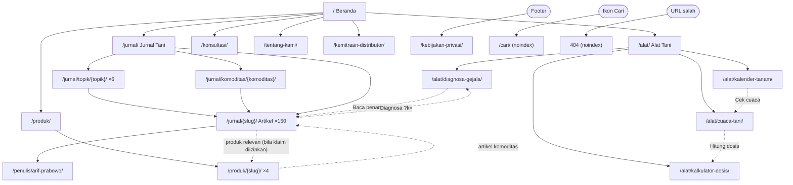

# Design Contract: Agritani — Portal Tani & Profil Distributor

> **Entitas**: Agritani ([agritani.com](https://agritani.com)) — portal pertanian yang dikelola resmi oleh Arif Prabowo dengan nama **Agritani Official** (belum berbadan hukum, DEC-017); 4 produk unggulan; kerja sama dengan brand pupuk & perusahaan pertanian ([DEC-016](DECISIONS.md))
> **Status**: Brand direction & behavior ACCEPTED (2026-09-29) · Composition **PROPOSED, reference-backed** (T-00 selesai) · Rendered UI **UNVERIFIED** (belum ada kode)
> **Stack**: Astro 7 static + Tailwind CSS 4 `@theme` ([DEC-004](DECISIONS.md)) · satu tema terang ([DEC-008](DECISIONS.md))
> **Owner skill**: `design-taste` → `impeccable` → `ui-validation`. Bukan admin UI.

Satu-satunya kontrak desain proyek: identitas brand, UX, token, komposisi,
dan gate bukti. Jangan membuat style guide, token file, atau dokumen UX
tandingan; perluas dokumen ini.

---

## 0. Evidence Status

| Aspek | Status | Dasar |
| :--- | :--- | :--- |
| Arah brand "Hybrid: sains + lapangan" | **ACCEPTED** | Keputusan Paduka Ongki 2026-09-29 ([DEC-011](DECISIONS.md)) |
| Prioritas audiens: petani dulu, B2B kedua | **ACCEPTED** | Keputusan Paduka Ongki 2026-09-29 ([DEC-011](DECISIONS.md)) |
| Aset brand (logo, kemasan, foto) | Logo **dibuat & diterima** (DEC-013, §1.4); kemasan & foto asli belum | Keputusan Paduka Ongki 2026-09-29 |
| Kontras token | **Measured (hex)** | Rasio WCAG dihitung dari hex; render diverifikasi di T-15 |
| Spesimen token (render) | **Observed** | Dua render headless 390px & 1440px: palet lama dan palet baru (§9) |
| Referensi pasar Indonesia & pola global | **Observed** | 9 halaman diinspeksi di 390px & 1440px pada 2026-09-29; 3 gagal dibuka (§4.0) |
| API cuaca BMKG | **Verified** | Endpoint, field, CORS `*`, batas 60/menit, atribusi wajib — diuji 2026-09-29 (DEC-014) |
| Data agrimarket (kalender, gejala) | **Seed, unverified** | Wajib ditinjau Arif Prabowo sebelum tampil (DEC-015, OQ-11) |
| Persona | **Assumption** | Proto-persona PRD §4 |

---

## 1. Brand Foundation

### 1.1. Posisi

**Pernyataan positioning:** Untuk petani sawit, padi, dan hortikultura serta
kios saprotan di Indonesia yang lelah dengan janji panen berlipat, Agritani
adalah **portal pertanian yang dikelola praktisi**: Arif Prabowo, konsultan
pertanian senior dengan lebih dari 8 tahun pengalaman di pertanian dan riset.
Portal ini bisa dipercaya karena **edukasinya bisa diperiksa**: jurnal berdaftar
pustaka dengan pengungkapan hubungan komersial yang jujur, empat produk
unggulan Agritani dengan nomor izin edar, kerja sama dengan brand pupuk dan
perusahaan pertanian, dan konsultasi langsung lewat WhatsApp (DEC-016).

| Pilar kepercayaan | Wujud di situs |
| :--- | :--- |
| Sains terbuka | Jurnal Tani oleh Arif Prabowo, Daftar Pustaka, Pengungkapan (beliau juga sales & konsultan produk Agritani) |
| Produk asli & legal | Nomor izin edar, cara cek keaslian kemasan (OQ-2, OQ-8) |
| Didampingi | Diagnosa Gejala + konsultasi WhatsApp berkonteks |

Pembeda dari kategori (§4.0): bukan kolase korporat hijau-kuning, bukan janji
angka panen, bukan marketplace. Situs tidak memposisikan Agritani sebagai
produsen atau lembaga riset (DEC-016, menggantikan DEC-010). Nama brand mitra tidak ditampilkan (NG-3); kerja sama disebut umum saja.

### 1.2. Karakter: Hybrid sains + lapangan

| Region | Rasa | Ekspresi |
| :--- | :--- | :--- |
| **Lapangan** — homepage, Alat Tani (`/alat/…`), Konsultasi, `/produk`, kemitraan | Sigap, cerah, praktis, "dipakai di kebun" | Sans tegas, hijau daun, kuning panen, foto lahan, kontrol tap-first |
| **Sains** — `/jurnal`, halaman artikel, `/tentang-kami` | Tenang, teliti, dapat dipercaya | Serif editorial, latar terang, kolom baca sempit, referensi rapi |

Kedua region memakai palet, grid, dan komponen yang sama; yang berbeda hanya
tipografi judul dan kepadatan (§3.2).

### 1.3. Suara & bahasa (untuk `copywriting`/`volumx-writer`)

- Bahasa Indonesia baku yang ringan, sapaan "Anda". Kalimat pendek, kata kerja di depan.
- Istilah petani dulu, istilah ilmiah menyusul: "patek (antraknosa, *Colletotrichum* spp.)".
- Label UI tanpa istilah Inggris: **Diagnosa Gejala** (bukan Triage), **Ringkasan Lapangan** (bukan Field Takeaway), **Jurnal Tani**, **Daftar Pustaka**, **Ajukan Kemitraan**, **Konsultasi via WhatsApp**.
- Satuan lokal: tangki 16 L, per hektare, HST, liter/ha. Angka dengan format `id-ID` (`1.250`, `2,5 ml`) melalui `Intl.NumberFormat`.
- Tanpa klaim absolut ("100%", "pasti", "menjamin") dan tanpa klaim hasil panen tanpa data uji (lihat §7).

### 1.4. Logo — "Tunas A" (DEC-013)

Simbol huruf **A**: kaki kiri adalah batang tegak, kaki kanan sehelai daun,
palang A menyatukan keduanya — *tumbuh dengan ilmu*. Dipilih Paduka Ongki
2026-09-29 dari tiga konsep (Tunas A, Petak Terasering, Titik Tunas) setelah
dirender di besar, di atas hijau, satu warna, dan 16px.

File (sumber kebenaran, SVG dengan huruf sudah menjadi path — tidak
bergantung font): `docs/brand/logo/`

| File | Pakai untuk |
| :--- | :--- |
| `agritani-logo.svg` | Logo utama di latar terang (simbol `brand` + tulisan `text`) |
| `agritani-logo-reverse.svg` | Di atas `brand` (header, footer): batang putih, daun `harvest`, tulisan putih |
| `agritani-logo-mono.svg` | Satu warna (`currentColor`): sablon karung, stempel, faks, cetak hitam-putih |
| `agritani-mark.svg` | Simbol saja: avatar media sosial, cap kemasan, watermark foto sendiri |
| `favicon.svg` | Favicon & ikon aplikasi: simbol di kotak `brand` radius 4 |
| `build-logo.py` | Membangun ulang semua file dari Plus Jakarta Sans 800 (OFL) + geometri simbol |

Aturan pemakaian:

- **Susunan**: simbol di kiri, tulisan "Agritani" (Plus Jakarta Sans 800, tracking −0.02em) di kanan; tinggi simbol ≈ 2,3 × tinggi huruf kapital tulisan (sesuai file SVG). Jangan menyusun ulang, memisah jarak, atau mengganti font tulisan.
- **Ruang kosong**: minimal setinggi palang A (±⅛ tinggi simbol) di semua sisi.
- **Ukuran minimum**: logo lengkap 24px tinggi di layar / 8 mm di cetak; di bawah itu pakai simbol saja (terbaca sampai 16px).
- **Warna yang diizinkan**: utama (terang), reverse (di atas `brand`), mono hitam atau putih. Daun kuning hanya pada versi reverse dan favicon.
- **Dilarang**: gradien, bayangan, outline, memutar, meregangkan, menaruh di atas foto ramai tanpa panel, mengganti warna di luar palet, menambah tagline di dalam logo.
- **Header situs**: `agritani-logo-reverse.svg` tinggi 32px, inline SVG (bukan ``) agar tanpa request tambahan, dengan `aria-label="Agritani — ke Beranda"` pada tautannya.

---

## 2. Information Architecture & Behavior

### 2.0. Peta Situs

Semua halaman v1, hierarki, dan tautan utama antarhalaman. Sitemap XML untuk
mesin pencari dihasilkan otomatis dari peta ini (§4.4.8); halaman `noindex`
tidak masuk.



| URL | Tipe / layout (§4.2.2) | Index | Anatomi | Task |
| :--- | :--- | :---: | :--- | :--- |
| `/` | Beranda · Lapangan | ✓ | §4.2.3 | T-08 |
| `/alat/` | Indeks alat · Lapangan | ✓ | §2.6.4 | T-22 |
| `/alat/diagnosa-gejala/` | Alat · Lapangan | ✓ | §2.2 | T-09 |
| `/alat/kalender-tanam/` | Alat · Lapangan | ✓ | §2.6.1 | T-19 |
| `/alat/cuaca-tani/` | Alat · Lapangan | ✓ | §2.6.2 | T-20 |
| `/alat/kalkulator-dosis/` | Alat · Lapangan | ✓ | §2.6.3 | T-21 |
| `/konsultasi/` | Konsultasi · Lapangan | ✓ | §2.7 | T-22 |
| `/jurnal/` | Indeks jurnal · Sains | ✓ | §4.2.3 | T-05 |
| `/jurnal/topik/{topik}/` (6) | Hub topik · Sains | ✓ bila ada artikel terbit | §4.2.3 | T-05 |
| `/jurnal/komoditas/{komoditas}/` | Hub komoditas · Sains | ✓ bila ≥ 3 artikel terbit | §4.2.3 | T-05 |
| `/jurnal/{slug}/` (150 naskah) | Artikel · Sains | ✓ bila terbit | §4.3 | T-05…T-07 |
| `/penulis/arif-prabowo/` | Profil · Sains | ✓ | §4.2.3 | T-10 |
| `/produk/` | Indeks produk · Lapangan | ✓ | §2.5 | T-11 |
| `/produk/{aussie,bensu,kojien,saratoga}/` | Detail produk · Lapangan | ✓ | §2.5 | T-11 |
| `/tentang-kami/` | Profil perusahaan · Sains | ✓ | §4.2.3 | T-10 |
| `/kemitraan-distributor/` | Kemitraan · Lapangan | ✓ | §2.3 | T-12 |
| `/kebijakan-privasi/` | Legal · Sains | ✓ | §4.2.3 | T-17 |
| `/cari/` | Pencarian · Lapangan | ✗ | §4.2.3 | T-14 |
| 404 | Galat · Lapangan | ✗ | §4.2.3 | T-04 |

Total v1: 18 tipe halaman; saat semua naskah terbit ±175 URL indexable
(13 halaman tetap + 6 hub topik + hub komoditas yang memenuhi syarat + 150 artikel
+ 4 produk). Hub dan artikel yang belum terbit tidak dibangun dan tidak masuk sitemap.

### 2.1. Navigasi

```
Desktop: [Agritani]  Alat Tani · Jurnal Tani · Konsultasi · Produk · Tentang Kami   (Ajukan Kemitraan) [Cari]
Mobile:  [Agritani]                                              [Cari] [Menu]
         Menu: Alat Tani (Diagnosa Gejala, Kalender Tanam, Cuaca Tani, Kalkulator Dosis), Jurnal Tani, Konsultasi, Produk, Tentang Kami, Ajukan Kemitraan
Footer:  identitas legal, alamat, nomor WhatsApp resmi sebagai teks kontak (bukan tombol), Kebijakan Privasi, tautan utama
```

- Anatomi lengkap header/footer ada di §4.2.1. Header berlatar `--color-brand`, tidak sticky. "Ajukan Kemitraan" tampil sebagai tombol **outline putih** (sekunder): prioritas petani dulu berarti aksi B2B tidak boleh menjadi elemen paling mencolok di setiap halaman.
- Menu mobile: `<dialog>` layar penuh dengan tombol "Tutup" terlihat; tutup dengan tombol atau Esc; fokus kembali ke tombol Menu.
- Halaman aktif: `aria-current="page"` + garis bawah 3px `--color-harvest` (bukan hanya warna).

### 2.2. Diagnosa Gejala (REQ-06)

Petani lebih cepat **mengetuk** daripada **mengetik**. Alur utama tap-first;
pencarian teks adalah jalur kedua lewat Pagefind (REQ-06b).

| Langkah | Kontrol | Perilaku |
| :--- | :--- | :--- |
| 1. Komoditas | Radio group bergaya tombol besar; daftar diturunkan dari `commodities` yang punya data gejala tertinjau (awal diharapkan: Sawit, Cabai, Padi, Jagung, Tomat) | Tersimpan di URL (`?k=cabai`); Back memulihkan state |
| 2. Bagian tanaman | Radio group (Daun, Batang/Pangkal, Buah/Bunga, Akar) | Hanya bagian yang punya data yang aktif; yang lain disabled + keterangan |
| 3. Gejala | Daftar pilihan berbahasa awam dari `symptoms` | Filter teks lokal opsional |
| 4. Hasil | Daftar kandidat: nama lokal, nama ilmiah, **tanda pembeda**, tautan artikel | Semua kandidat ditampilkan, diurutkan kecocokan |

State wajib:

- **Jenis penyebab**: setiap kandidat diberi label penyebab — **Penyakit**, **Hama**, **Kekurangan hara**, atau **Lingkungan** (misal terbakar matahari, genangan). Cabang hara & lingkungan penting karena banyak gejala bukan patogen (pola UC IPM, §4.0).
- **Judul hasil = jalur pilihan**: "Cabai › Buah › Bercak cekung melingkar" sebagai H1 hasil + breadcrumb (pola UMN, §4.0).
- **Aksi per hasil**: hanya "Baca penanganan" (tautan artikel). Satu blok konsultasi muncul **sekali** di bawah seluruh daftar hasil, dengan pesan terisi konteks (komoditas, bagian, gejala) — bukan tombol per kandidat (§2.8).
- **Tanpa JS**: indeks gejala per komoditas sebagai daftar tautan statis.
- **Kosong**: "Belum ada diagnosis untuk kombinasi ini" + tautan Jurnal Tani + blok konsultasi (satu-satunya ajakan WhatsApp di state ini).
- **Kandidat mirip**: tanda pembeda wajib tampil (misal thrips vs virus kuning keriting).
- **Disclaimer** satu kalimat di atas hasil: panduan awal, bukan pengganti pemeriksaan agronomis di lahan.
- Foto gejala: hanya bila berlisensi dan identifikasinya diverifikasi (Proposal P-2). v1 boleh tanpa foto.

### 2.3. Ajukan Kemitraan (REQ-02)

- Field: Nama, Nama Usaha, Jenis Usaha (Kebun/Perkebunan, Kios Saprotan, Distributor, Kelompok Tani), Provinsi, Kabupaten/Kota, Luas lahan (ha) atau kapasitas, Nomor WhatsApp, Pesan (opsional).
- Label di atas field; placeholder hanya contoh. `inputmode="tel"`, `autocomplete` sesuai.
- Validasi native + pesan per field yang menyebut cara memperbaiki ("Nomor minimal 10 digit, contoh 081234567890"). Nilai tidak hilang saat error.
- Kirim → susun pesan terstruktur → buka `wa.me` (DEC-006). Setelah itu tampil "Lanjutkan percakapan di WhatsApp" + nomor tertulis sebagai cadangan. Tidak pernah menampilkan "terkirim".

### 2.4. Artikel (REQ-03/04/05)

Anatomi lengkap, perilaku, dan struktur SEO halaman artikel ada di **§4.3**.
Ringkasnya: jawaban dulu, bacaan panjang kemudian; tanpa JS wajib; penulis
Arif Prabowo dengan pengungkapan hubungan komersialnya dengan produk Agritani.

### 2.5. Produk (REQ-01) — 4 produk

Katalog hanya berisi empat produk. Dikelompokkan menurut **komoditas sasaran**
(cara petani mencari), bukan pilar korporat:

| Produk | Komoditas sasaran (data pemilik) | Peran | Tagline pemilik |
| :--- | :--- | :--- | :--- |
| **Aussie** | Kelapa sawit, tanaman keras (cengkeh, kopi, kakao, durian, mangga, alpukat, jeruk) | Aktivator imun, Ganoderma & busuk pangkal batang | "Obat Ganoderma Pertama di Dunia" ⚠ |
| **Kojien** | Padi sawah & ladang | Aktivator imun khusus padi (blas, hawar pelepah, bercak coklat) | "Immune Cell Activator Teknologi Thailand (Spesialis Padi)" |
| **BENSU** | Jagung, kedelai, cabai, tomat, bawang, semangka, melon | Aktivator imun + regenerasi sel | "Immune Cell Activator dan Cell Regeneration" |
| **Saratoga** | Pangan, hortikultura, perkebunan, buah | Asam amino untuk fase pembungaan & pembentukan buah | "Asam Amino Bebas Bau Amis dan Bebas Hama" ⚠ |

Status klaim dari `docs/research/web-scan.md` — ditampilkan hanya setelah
diverifikasi terhadap label, kategori izin edar, dan bukti uji (OQ-2, OQ-9):

| Klaim | Produk | Status v1 |
| :--- | :--- | :--- |
| "Obat Ganoderma Pertama di Dunia" | Aussie | **Ditahan**: klaim superlatif global + kata "obat" pada produk berkategori stimulator/organik |
| "Membasmi Ganoderma dalam 7–14 hari" | Aussie | **Ditahan**: bertentangan dengan `scientific-validation.md` (penanganan hanya memperlambat bila kerusakan vaskular luas) |
| "Menaikkan produksi sawit hingga 50%" | Aussie | **Ditahan** sampai ada data uji (lokasi, periode, pembanding) |
| "Mengobati bulai, layu fusarium, busuk…" | BENSU | **Ditahan**: klaim pengendalian penyakit harus sesuai kategori izin edar |
| "1 produk setara 3–4 produk" | BENSU | **Ditahan** sampai ada dasar pembanding |
| "Bebas hama" / "tidak menarik lalat buah" | Saratoga | **Direvisi** menjadi "tanpa bau amis" kecuali ada data uji |
| Kandungan (bahan organik 87,85%, S, Mo; asam amino, omega 3, kitosan, B1) | Aussie, Saratoga | Boleh tampil bila sesuai label |
| Terdaftar di Kementan | Semua | Tampil **dengan nomor izin edar**, bukan pernyataan umum |

Tampilan:

- `/produk`: empat baris yang dapat dibandingkan (nama, komoditas, peran, metode aplikasi); ≥1024px boleh tabel perbandingan. Empat item sebanding → baris/tabel seragam dibenarkan.
- Filter/anchor per komoditas ("Untuk sawit", "Untuk padi", "Untuk sayur & buah") agar petani langsung ke produk yang relevan.
- Dari hasil Diagnosa Gejala dan artikel, tautan produk hanya muncul bila komoditas cocok dan klaimnya diizinkan labelnya.
- Detail: fungsi, komposisi, dosis & metode aplikasi dari label resmi, **nomor izin edar** (OQ-2), cara cek keaslian kemasan (OQ-8). **Tanpa ajakan WhatsApp** (DEC-019). Harga kemasan hanya dari `products.json` dengan tanggal cek, tanpa nama situs sumber; tanpa keranjang atau tautan marketplace (NG-1).

### 2.6. Alat Tani (REQ-06, REQ-09, REQ-10, REQ-11)

Prinsip bersama semua alat:

- **Tanpa akun, tanpa server milik Agritani.** Semua perhitungan di browser; satu-satunya data jaringan adalah prakiraan BMKG (Cuaca Tani).
- **Hasil bisa dibagikan**: status alat tercermin di URL query (`?k=cabai&t=2026-10-12`), sehingga tautan yang dibagikan membuka hasil yang sama.
- **Ingat pilihan terakhir** (komoditas, lokasi) di `localStorage` perangkat pengguna, dibungkus `try/catch`; alat tetap berfungsi bila penyimpanan diblokir. Tidak pernah dikirim ke mana pun.
- **Tanpa JS**: setiap alat menampilkan konten statis yang tetap berguna (indeks gejala, tabel musim tanam, rumus kalkulator, tautan BMKG) + pesan bahwa fitur interaktif butuh JavaScript.
- **Setiap hasil punya jalan lanjut**: artikel terkait, alat lain yang relevan, dan **satu** blok konsultasi di akhir hasil dengan kode sumber (G-6). Blok konsultasi hanya muncul setelah ada hasil, tidak sebelum pengguna mencoba alatnya (§2.8).
- **Hierarki halaman alat**: H1 nama alat → satu kalimat kegunaan → form input (label di atas field) → hasil (`aria-live="polite"`, fokus pindah ke judul hasil) → penjelasan cara kerja & sumber data → tautan lanjut.

#### 2.6.1. Kalender Tanam — "Rencana Tanam Saya" (REQ-09)

| Langkah | Kontrol | Perilaku |
| :--- | :--- | :--- |
| Komoditas | Radio bergaya tombol (komoditas yang datanya sudah ditinjau) | Komoditas tanpa `reviewedBy` tidak muncul |
| Tanggal tanam | `<input type="date">` native, default hari ini | Label "Tanggal tanam / pindah tanam"; boleh tanggal lampau (tanaman sudah berjalan) atau rencana |
| Hasil | Timeline vertikal fase | Lihat di bawah |

Hasil untuk tanaman semusim:

- Ringkasan atas: "Hari ini **HST 34** — fase **Vegetatif**" (bila tanggal tanam lampau) + perkiraan panen "12–26 Feb 2027".
- Timeline vertikal (bukan tabel lebar): tiap fase = nama fase, rentang HST, rentang tanggal, 2–4 kegiatan kunci, "Waspadai" (OPT dengan tautan artikel/Diagnosa). Fase berjalan disorot dengan latar `tint` + label teks "Sedang berjalan".
- Aksi: **Simpan ke kalender HP** (`.ics` dibuat di browser, satu event per fase + pengingat panen), **Cetak**, **Bagikan** (lembar bagi bawaan perangkat, §2.8), **Cek cuaca untuk aplikasi** (→ Cuaca Tani).
- Bagian "Musim tanam nasional": MT1/MT2/MT3 bulan tanam & panen untuk komoditas itu, diberi label "rata-rata nasional — jadwal di daerah Anda bisa berbeda; tanyakan penyuluh setempat".

Kelapa sawit (tahunan): tanpa HST; tampilkan kalender perawatan 12 bulan (pemupukan, sensus/pengamatan Ganoderma, sanitasi, panen rutin) dari data yang ditinjau.

Tidak ditampilkan: merek benih/pupuk/pestisida, harga, dosis pestisida, skenario iklim tahun tertentu.

#### 2.6.2. Cuaca Tani (REQ-10)

| Langkah | Kontrol | Perilaku |
| :--- | :--- | :--- |
| Lokasi | 4 `<select>` bertingkat: Provinsi → Kabupaten/Kota → Kecamatan → Desa/Kelurahan | Opsi tingkat berikut dimuat saat tingkat sebelumnya dipilih (file JSON per kabupaten); lokasi terakhir diingat |
| Hasil | Prakiraan 3 hari per 3 jam | Diambil langsung dari API publik BMKG (`adm4`) di browser |

Tampilan hasil:

- Judul: nama desa, kecamatan, kabupaten + "Diperbarui BMKG {analysis_date}".
- Per hari: baris slot 3 jam (jam lokal · ikon cuaca + deskripsi · suhu °C · kelembapan % · hujan mm · angin km/jam + arah) dalam tabel dengan `tabular-nums`; di mobile tabel bergulir di dalam wrapper, kolom jam tetap.
- **Indikator aplikasi lapangan** per slot: **Layak** / **Hati-hati** / **Tunda** — selalu teks + ikon, bukan warna saja, dengan alasan singkat ("hujan 2 mm", "angin 18 km/jam"). Ambang = parameter awal yang **wajib divalidasi Arif Prabowo (OQ-11)** sebelum rilis; sampai divalidasi, indikator disembunyikan dan hanya data BMKG yang tampil.
- Ringkasan atas: "Waktu terbaik menyemprot hari ini: 06.00–09.00" (slot Layak pertama), bila indikator aktif.
- Atribusi wajib: "Sumber data: BMKG (Badan Meteorologi, Klimatologi, dan Geofisika)" + tautan ke situs BMKG, di bawah hasil.

State: memuat (skeleton baris tabel, tanpa spinner penuh layar) · gagal/offline ("Prakiraan BMKG belum bisa dimuat. Coba lagi." + tombol + tautan BMKG) · data lama (bila `analysis_date` > 24 jam, tampilkan peringatan).

#### 2.6.3. Kalkulator Dosis (REQ-11)

| Input | Kontrol | Validasi |
| :--- | :--- | :--- |
| Dosis dari label | angka + satuan (`ml/L`, `g/L`, `ml/tangki`, `g/tangki`) | > 0; wajib |
| Volume tangki | angka, default 16 L | 1–1000 |
| Luas lahan | angka + satuan baku (`m²`, `ha`) | > 0; satuan lokal (rante, bata, tumbak) tidak dipakai karena luasnya berbeda antar daerah |
| Volume semprot | angka L/ha (petunjuk: "lihat label atau tanya agronom") | 50–1000 |

Hasil (dihitung saat input berubah, `aria-live`): **per tangki** (ml/g), **jumlah tangki** (dibulatkan ke atas), **total produk** (ml/g dan L/kg), plus baris "Cara hitung" yang menampilkan rumus dengan angka pengguna. Angka format `id-ID`. Tanpa prefill dosis produk kecuali dari label resmi (OQ-2). Peringatan tetap: "Ikuti dosis pada label kemasan; kalkulator hanya membantu hitungan."

#### 2.6.4. Indeks Alat Tani `/alat/`

H1 "Alat Tani" · satu kalimat · catatan "Semua alat gratis, tanpa registrasi atau akun…" · 4 baris indeks terbuka (grid nama 14rem · kegunaan + status · aksi), alat yang aktif di atas; alat yang disembunyikan (data belum ditinjau, OQ-11) berstatus "Segera hadir" dengan aksi "Lihat status". Tanpa kartu, tanpa pill.

### 2.7. Konsultasi (REQ-12)

- Halaman `/konsultasi/`: siapa yang menjawab (tim agronomi Agritani; peran Arif Prabowo sesuai OQ-4), jam layanan (OQ-1), apa yang disiapkan (foto gejala dekat & seluruh tanaman, komoditas, umur tanaman/HST, luas lahan, kabupaten, riwayat semprot/pupuk 2 minggu terakhir), lalu **form penyusun pesan**: Komoditas · Umur tanaman · Kabupaten · Masalah (textarea) → "Lanjutkan di WhatsApp".
- Pesan WhatsApp berformat tetap, baris pertama kode sumber (G-6):
  ```
  [Web·Konsultasi]
  Komoditas: Cabai
  Umur tanaman: 45 HST
  Lokasi: Kab. Garut
  Masalah: buah busuk hitam melingkar
  (Saya akan kirim foto setelah pesan ini)
  ```
- Tombol konsultasi berkonteks di tempat lain memakai kode: `[Web·Diagnosa]`, `[Web·Kalender]`, `[Web·Cuaca]`, `[Web·Kalkulator]`, `[Web·Artikel:{slug}]`, `[Web·Produk:{slug}]`, `[Web·Kemitraan]`.
- Pernyataan tetap: saran konsultasi adalah panduan, bukan jaminan hasil; untuk keadaan darurat hama wabah, hubungi juga penyuluh/dinas pertanian setempat.
- Tanpa chatbot, tanpa widget chat melayang.

### 2.8. Aturan Ajakan WhatsApp (anti-spam)

WhatsApp adalah jalur konsultasi utama, justru karena itu tidak boleh diobral.
Ajakan yang muncul di mana-mana terasa seperti iklan dan merusak kesan tepercaya
Jurnal Tani (keputusan Paduka Ongki 2026-09-29).

**Aturan:**

1. **Maksimal satu ajakan WhatsApp per halaman** (satu `ConsultPrompt` atau satu tombol kirim form). Tautan nomor di footer tidak dihitung karena berupa teks kontak, bukan ajakan.
2. **Di akhir tugas, bukan di awal**: setelah hasil alat, di blok Tentang penulis artikel, di bawah bio profil penulis, atau sebagai tombol kirim form (tidak ada di halaman produk, DEC-019). Tidak pernah di header, menu, hero, di atas lipatan pertama sebelum pengguna mendapat nilai, atau di tengah prosa.
3. **Tidak ada elemen WhatsApp melayang, sticky bar, pop-up, atau per item daftar.**
4. **Bentuk**: tombol sekunder (outline) dengan ikon `MessageCircle` monokrom dan label kata kerja yang spesifik ("Tanya agronom tentang hasil ini"), bukan hijau khas WhatsApp. Tombol primer hanya di `/konsultasi/` dan `/kemitraan-distributor/`, di mana mengirim ke WhatsApp memang tugas utamanya.
5. **Bagikan ≠ konsultasi**: fitur bagikan memakai lembar bagi bawaan perangkat (`navigator.share`), yang di HP sudah memuat WhatsApp, sehingga tidak ada ikon WhatsApp kedua di halaman.

**Penempatan per halaman:**

| Halaman | Ajakan WhatsApp | Letak |
| :--- | :--- | :--- |
| Beranda | **Tidak ada** | Section Konsultasi menaut ke `/konsultasi/` |
| Header, menu, footer | **Tidak ada** tombol | Nav "Konsultasi" → halaman; footer: nomor sebagai teks kontak |
| Indeks Jurnal, hub, indeks Alat, indeks Produk, detail produk, Kebijakan Privasi, Cari, 404 | **Tidak ada** | Di indeks Jurnal, halaman paginasi, hub topik/komoditas, dan arsip tag, nomor di footer juga tampil sebagai **teks biasa tanpa tautan WhatsApp** (`BaseLayout noWhatsApp`, keputusan pemilik 2026-09-30) |
| Tentang Kami | 1 (primer) | "Chat tim penjualan via WhatsApp" di bagian "Menjadi agen atau distributor", sumber `Web·TentangKami` (DEC-021) |
| Profil penulis `/penulis/arif-prabowo/` | 1 | "Konsultasi dengan Arif Prabowo" di bawah bio, sumber `Web·Penulis`; teks menyebut pesan dikirim ke WhatsApp resmi Agritani (keputusan pemilik 2026-09-30) |
| Artikel | 1 | Tautan teks berikon "WhatsApp Agritani" di blok **Tentang Penulis** (sumber `Web·Artikel:{slug}`, pesan memuat judul artikel; keputusan pemilik 2026-09-30, kotak konsultasi terpisah dihapus) |
| Diagnosa Gejala | 1 | Di bawah seluruh daftar hasil (atau di state kosong), setelah pengguna memilih |
| Kalender Tanam, Cuaca Tani, Kalkulator Dosis | 1 | Di akhir hasil, hanya setelah hasil tampil |
| Konsultasi | 1 (primer) | Tombol kirim form penyusun pesan |
| Kemitraan | 1 (primer) | Tombol kirim form kemitraan |

---

## 3. Visual System

### 3.1. Warna

Target REQ-08: teks ≥ 7:1, indikator non-teks ≥ 3:1. Angka: canvas / surface / tint.

```css
@theme {
  /* Brand */
  --color-brand: #1A6335;          /* Hijau Daun — header, tombol primer (teks putih 7.3:1) */
  --color-brand-hover: #14502B;    /* Hover tombol primer (teks putih 9.5:1) */
  --color-brand-strong: #0F5C33;   /* Tautan, state aktif, ring fokus di latar terang — 7.6 / 8.1 / 7.2 */
  --color-harvest: #F2B632;        /* Kuning Panen — tombol aksen, penanda aktif; teks gelap 9.1:1 */
  --color-harvest-hover: #F7C955;  /* teks gelap 10.6:1 */
  --color-soil: #5C3A1E;           /* Tanah — label field di Ringkasan Lapangan, tautan topik di metadata — 9.5 / 10.1 / 9.0 */

  /* Surfaces */
  --color-canvas: #F8F8F3;         /* Latar halaman */
  --color-surface: #FFFFFF;        /* Form, tabel, panel data */
  --color-tint: #EEF3E6;           /* Band section lapangan, Ringkasan Lapangan */
  --color-harvest-tint: #FBF3DC;   /* Peringatan ringan, band kemitraan */

  /* Text */
  --color-text: #16211A;           /* 15.6 / 16.6 / 14.7 */
  --color-text-muted: #3B4A40;     /* Metadata, caption — 8.8 / 9.4 / 8.3 */

  /* Lines & state */
  --color-border: #E3E6DD;         /* Dekoratif di DALAM komponen saja */
  --color-border-control: #6B7A70; /* Border input/radio — 4.3 / 4.5 / 4.0 */
  --color-danger: #9B1C1C;         /* Error & peringatan keselamatan — 7.7 / 8.2 / 7.2 */
}
```

Aturan pemakaian:

- Di atas `--color-brand` hanya teks putih penuh (tidak ada putih transparan/abu — gagal 7:1). Ring fokus di header memakai `--color-harvest` (4.0:1).
- Kuning Panen adalah **fill dengan teks gelap**, tidak pernah teks kuning di latar terang.
- Hijau dan kuning tidak pernah menjadi satu-satunya pembawa makna; selalu ada label atau ikon.
- **Anti-klise kategori** (§4.0): hijau jenuh + kuning adalah bahasa visual umum situs pupuk Indonesia. Agritani membedakan diri lewat takaran: latar selalu `canvas`/`tint` yang terang; fill `brand` hanya untuk header, tombol primer, dan footer; `harvest` maksimal satu elemen per viewport; tanpa kolase CGI daun/pabrik.
- Tanpa gradien, tanpa hijau neon, tanpa latar foto di balik teks panjang. **Pengecualian pemilik (2026-09-30):** hero Beranda boleh teks pendek (H1 + satu kalimat + tombol) di atas foto dengan gradien `brand-strong` dari bawah; latar teks median ±7:1 dan titik terang ≥ 4,5:1 (AA) di 390 & 1440 — pemilik memilih foto lebih jelas daripada 7:1 penuh.

### 3.1.1. Warna topik Jurnal (diadaptasi dari kode sektor teagasc.ie)

Enam topik Jurnal punya satu warna penanda. Warna ini **hanya** dipakai sebagai
garis 3px di atas tab/judul hub dan kotak kecil 8px di depan label topik; teks
tetap `--color-text`/`--color-soil`, jadi makna tidak pernah dibawa warna saja.
Kontras non-teks terhadap `canvas` ≥ 3:1.

```css
--color-topic-proteksi-tanaman: #B3261E;      /* merah hama — 6.1:1 */
--color-topic-tanah-nutrisi: #7A4A22;         /* tanah — 7.0:1 */
--color-topic-budidaya: #2F7D32;              /* daun — 4.8:1 */
--color-topic-air-irigasi: #1F6FA8;           /* air — 5.1:1 */
--color-topic-pascapanen-agribisnis: #B26A00; /* panen — 4.0:1 */
--color-topic-sains-tanaman: #0F766E;         /* klorofil-teal — 5.1:1 */
```

Sumber tunggal slug → nama → warna: `src/lib/topics.ts`.

### 3.2. Tipografi

| Peran | Font | Dipakai di |
| :--- | :--- | :--- |
| Display & UI | **Plus Jakarta Sans** (typeface buatan studio Indonesia, OFL) 400, 400 italic, 600, 800 | Wordmark, judul region lapangan, navigasi, tombol, form, body; italic untuk nama ilmiah |
| Editorial | **Newsreader** (OFL) 600, 600 italic | Judul artikel, H2/H3 artikel, judul bacaan unggulan, `/tentang-kami`; italic untuk nama ilmiah di dalam judul |
| Angka teknis | Plus Jakarta Sans + `font-variant-numeric: tabular-nums` | Dosis, NPK, HST, luas lahan |

- Self-hosted `woff2` subset Latin + Latin Extended (6 file); total font ≤ 130 KB, dan hanya file yang dipakai halaman itu yang dimuat; `font-display: swap` dengan fallback metrik yang disesuaikan (`size-adjust`) untuk menekan CLS.
- Tanpa monospace untuk dosis (terbaca seperti kode di spesimen).
- Skala: display `clamp(2rem, 1.4rem + 2.6vw, 3rem)` / 1.1 · H1 artikel `clamp(2rem, 1.5rem + 2vw, 2.75rem)` / 1.15 · H2 `clamp(1.375rem, 1.2rem + 0.8vw, 1.75rem)` / 1.25 · H3 `1.1875rem` / 1.35 · body UI `1rem` / 1.5 · body artikel `1.0625rem` (mobile) → `1.125rem` (≥768px) / **1.75** · kecil `0.875rem` / 1.45 (minimum teks bermakna).
- Line-height 1.75 hanya untuk prosa artikel; UI, metadata, dan form 1.4–1.5.
- Measure prosa `68ch`; judul `text-wrap: balance`; prosa `text-wrap: pretty`; tanpa `<br>` paksa.

### 3.3. Ruang, grid, bentuk

- Skala spasi (rem): `0.25 · 0.5 · 0.75 · 1 · 1.5 · 2 · 3 · 4 · 6`. Jarak antar-section: `3rem` mobile, `4–6rem` desktop.
- Kontainer: maks `72rem`, gutter `1rem` (<640px) / `1.5rem` / `2rem` (≥1024px). Grid 12 kolom di ≥1024px; satu kolom di bawahnya.
- Radius: `0` untuk section, band, dan foto; `2px` untuk tombol, input, tabel, panel, dan kartu. Tanpa `rounded-2xl/3xl`, pill dekoratif, bayangan kartu.
- Elevasi hanya untuk menu mobile/dialog (satu bayangan).
- **Tidak ada garis pemisah antar-section** atau di atas/bawah hero dan footer. Satu pengecualian pemilik (2026-09-30): bilah 6 warna topik di atas footer sebagai penanda sektor (bukan garis abu-abu pemisah). Transisi section memakai spasi dan pergantian latar (`canvas` ↔ `tint`). Garis hanya di dalam komponen (baris tabel/indeks, border input).
- Tanpa garis tebal di sisi kiri kartu/panel sebagai aksen; panel dibedakan oleh latar `tint` dan judulnya.

#### 3.3.1. Presisi media–teks (aturan, 2026-09-30)

- Baris artikel dengan thumbnail (Beranda, dan daftar artikel lain yang memakai thumbnail); baris produk memakai gambar `object-contain` berukuran tetap dan tidak termasuk aturan ini: **tepi atas gambar = tepi atas teks label**, **tepi bawah gambar = tepi bawah baris meta**. Caranya: baris `display:flex; align-items:stretch`; gambar `align-self:stretch` dengan lebar tetap (`w-28` / `sm:w-32`), tinggi minimum `4.5rem`, `object-fit: cover`, dan digeser turun sebesar jarak visual teks label di dalam area sentuh 44px (`mt-3`), sehingga area sentuh tetap ≥ 44px tanpa merusak garis sejajar. Kelas grid/tinggi diletakkan di `pictureAttributes` agar `<picture>` ikut meregang.
- Toleransi terukur: selisih ≤ 1px di 390 & 1440 (skrip ukur geometri di bukti UI). Gambar dekoratif di baris yang sudah punya judul memakai `alt=""` dan tautan `aria-hidden`/`tabindex="-1"`.
- Jarak tetap label → judul 4px, judul → meta 8px; judul maksimal 2 baris (`line-clamp-2`).
- Offset atas mengikuti ukuran teks label di dalam area sentuh 44px: label 14px/20px → `mt-3` (Beranda); label 12px/16px → `mt-3.5` (`ArticleRow` di Jurnal, hub, penulis, cari). Bila baris diakhiri `.link-more`, tepi bawah gambar = bilah `.link-more` (wrapper `-mb-0.5`). Di bawah 640px baris bertumpuk (gambar di atas, 16:10) dengan jarak gambar → teks label ±20px (`gap-1.5`).

#### 3.3.3. Kartu (aturan pemilik, 2026-09-30)

Pemilik: "boleh pakai card namun rapi". Kartu dipakai **hanya untuk satu unit utuh** yang bisa dipilih atau dibandingkan, bukan untuk membungkus section atau paragraf.

- **Satu gaya kartu** di seluruh situs: kelas `.card` di `global.css` — latar `surface` (putih), garis 1px `border`, radius 2px, **tanpa bayangan**. Kartu bertaut: `.card.card-link`, garis menggelap ke `brand-strong` saat hover/fokus; seluruh kartu adalah area sentuh (tautan judul dengan `after:absolute after:inset-0`). Area gambar: `.card-media` (latar `tint`), gambar `object-cover` penuh tanpa bingkai kedua.
- **Dipakai untuk:** produk (katalog, blok produk di artikel), panel harga di detail produk, panel "Sifat formula", input dan hasil alat, tautan alat lanjutan, kartu penulis di akhir artikel, bacaan terkait, formulir Konsultasi/Kemitraan.
- **Tidak dipakai untuk:** section halaman, prosa, judul, daftar artikel di Jurnal/hub (tetap `ArticleRow` terbuka, §3.3.1), Beranda (disetujui 2026-09-30, tetap terbuka).
- Padding kartu: `p-4` di bawah 640px, `sm:p-6` ke atas (formulir/alat boleh `lg:p-8`), agar kolom isian di HP tetap lebar (T-40).
- Tanpa kartu di dalam kartu. Kartu dalam satu baris sama tinggi (`h-full`), padding sama (`p-4`/`p-5`/`p-6` per jenis), dan tepi kartu jatuh di garis grid yang sama.
- Referensi arah (diperiksa 2026-09-30, tangkapan layar di bukti UI): katalog & detail Koppert (kartu produk putih, sumur gambar seragam, spesifikasi kunci–nilai), artikel GOV.UK / UMN Extension (prosa tanpa kotak, kotak penulis di akhir), alat GOV.UK (hasil = satu-satunya panel). Radius besar dan tombol WhatsApp di referensi **tidak** diambil (§3.3, §2.8).

#### 3.3.4. Tampilan HP (audit 2026-09-30, T-40)

- Diaudit otomatis di 360 & 390 px untuk 20 halaman: tanpa scroll horizontal, tanpa elemen keluar layar, teks ≥ 12px (kecuali lencana "Draf" khusus mode dev).
- Area sentuh ≥ 44px: `.link-more` memakai perluasan tak terlihat `::before` (±5px atas-bawah) sehingga geometri baris §3.3.1 tidak berubah; tautan tag dan "Pilih sesuai tanaman" `py-3`; tombol hero Beranda `min-h-[44px]`; tautan "Waspadai" di Kalender Tanam `min-h-[44px]`. Tautan sebaris di dalam kalimat (byline, DOI) mengikuti pengecualian inline.
- Sidebar hub (`TopicSidebar`) diletakkan **setelah** konten di DOM (≥1024px tetap di kiri lewat penempatan grid) agar H1 halaman menjadi judul pertama bagi pembaca layar.

#### 3.3.2. Kolom sticky (aturan, 2026-09-30)

- Header situs tidak sticky, jadi kolom samping (≥1024px) menempel **24px dari tepi atas layar** (`lg:sticky lg:top-6`). Jarak awal dari judul halaman memakai **margin** (`lg:mt-10`), bukan padding, agar tidak ikut terbawa saat menempel.
- **Keadaan tertutup wajib muat di layar tanpa scroll** pada viewport 1280×700 ke atas (terukur: `TopicSidebar` 636px, tepi bawah 660px). Karena itu `TopicSidebar` hanya menampilkan 5 komoditas teratas; sisanya di balik `<details>` "Lihat N komoditas lain" (otomatis terbuka bila komoditas aktif ada di dalamnya).
- Batas tinggi `calc(100vh - 3rem)` dan scroll internal **hanya aktif saat bagian dibuka** (`:has(details[open])`), tanpa JavaScript. Daftar isi artikel memakai batas tinggi yang sama.
- Sticky berhenti di akhir wadah kontennya (perilaku normal); <1024px kolom samping tidak sticky dan pindah ke bawah konten.

### 3.4. Ikon & ilustrasi

- Lucide, hanya ikon fungsional yang memperjelas aksi atau kategori: `MessageCircle` (WhatsApp), `Search`, `Printer`, `Droplets` (dosis), `Sprout` (komoditas), `ShieldCheck` (cek keaslian), `MapPin` (wilayah), `ChevronRight`.
- Tanpa `Sparkles`, bintang, tongkat sihir, atau ikon mini di heading. Tanpa ilustrasi 3D atau maskot.
- **Tanpa kicker/eyebrow** (label kecil huruf kapital di atas judul) di seluruh situs (impeccable craft-floor). Topik/komoditas tampil di breadcrumb atau baris metadata di bawah judul.
- Diagram (siklus penyakit, cara aplikasi) boleh sebagai SVG sederhana dua warna bila benar-benar menjelaskan isi.

### 3.5. Fotografi (belum ada aset)

- Prioritas: foto lahan Indonesia asli milik Agritani atau mitra dengan izin tertulis (kebun sawit, cabai, sawah, kios saprotan, tangan petani yang bekerja). Cahaya siang alami, warna tidak disaturasi berlebihan, tanpa pose studio.
- Sebelum aset asli ada (OQ-5): foto berlisensi boleh dipakai **hanya sebagai ilustrasi konteks** dengan kredit, tidak pernah disajikan sebagai demplot, mitra, pelanggan, hasil panen, atau produk Agritani.
- Dilarang: foto petani luar negeri, traktor gaya Amerika/Eropa, tangan memegang kecambah bercahaya, laboratorium stok, dan gambar AI yang menyerupai kemasan (kecuali ilustrasi kemasan 4 produk yang disetujui pemilik, §3.5.1) atau hasil lapangan.
- Teknis: `astro:assets`, `width`/`height` eksplisit, AVIF/WebP, hero ≤ 90 KB di 390px; `alt` mendeskripsikan isi agronomis.
- Bila tidak ada foto layak, region lapangan tetap lengkap tanpa foto (lihat C3). Situs harus tetap berfungsi tanpa gambar.

#### 3.5.1. Gambar Dummy Sementara (T-26)

Diminta Paduka Ongki 2026-09-29 agar situs tidak kosong sebelum foto asli (OQ-5) tersedia. Semua gambar di sini berstatus sementara dan wajib diganti foto asli.

- **Sumber & Lisensi**: Pexels, Unsplash, atau Pixabay. Gratis komersial, atribusi dicatat di `src/assets/images/dummy/CREDITS.md`.
- **Aturan Pemilihan**: Lanskap/tanaman tropis Indonesia (sawit, padi, cabai, sayuran, irigasi, kios). Tanpa wajah yang dapat dikenali, tanpa traktor asing, tanpa merek pihak ketiga. Dilarang untuk kemasan produk, foto profil penulis, atau foto gejala penyakit.
- **Format**: WebP wajib (`quality: 72`, sharp), file sumber ≤ 250 KB.
- **11 Slot Gambar** (dipakai sesuai tabel; kredit terverifikasi dari JSON-LD halaman sumber, lihat `CREDITS.md`):

| Berkas | Rasio | Dipakai di |
| :--- | :--- | :--- |
| `hero-beranda.webp` | 5:4 | Hero Beranda (LCP, `fetchpriority=high`, ≤ 90 KB di 390px) |
| `alat-tani.webp` | 5:4 | Pilar Alat Tani, Beranda |
| `konsultasi.webp` | 3:2 → 5:4 | Pilar Konsultasi, Beranda · kolom kiri `/konsultasi/` |
| `kemitraan.webp` | 3:2 → 5:4 | Pilar Kemitraan, Beranda · header `/kemitraan-distributor/` |
| `tentang-kami.webp` | 3:2 | Gambar utama `/tentang-kami/` |
| `topik-{topik}.webp` ×6 | 16:9 | Header hub topik |

- **Gambar artikel** (`komoditas-{padi,cabai,kelapa-sawit,jagung,sayuran-daun,tomat,mangga,bawang-merah,kakao,durian,jeruk,kopi}.webp`, 16:9, Pixabay, penulis diverifikasi dari JSON-LD, 2026-09-30): `getArticleImage()` di `src/lib/topic-images.ts` memilih komoditas pertama artikel yang punya foto, jika tidak gambar topik. Dipakai untuk gambar utama artikel (bila `heroImage` tidak diisi), thumbnail `ArticleRow`, dan kolom Jurnal di Beranda. Di hub komoditas dan "Bacaan terkait" thumbnail memakai gambar **topik** (`imageBy="topic"`) agar tidak kembar. Keterangan gambar utama: "Foto ilustrasi, bukan dokumentasi kasus di artikel ini."; `alt=""` karena dekoratif. Bukan foto gejala: foto gejala hanya asli/berlisensi (P-2), tidak pernah AI.
- **Ilustrasi kemasan produk** (`produk-{aussie,bensu,kojien,saratoga}.webp`): buatan AI, **disetujui pemilik 2026-09-30** sebagai ilustrasi sementara sampai foto kemasan asli (OQ-5); alt "Kemasan {nama produk}"; dicatat di `CREDITS.md`. Teks kecil pada label ilustrasi tidak boleh dijadikan sumber klaim produk.
- **Pengiriman**: selalu lewat `<Picture>`/`<Image>` `astro:assets` dengan `widths` + `sizes` dan `quality` 52–60; kelas grid diletakkan di `pictureAttributes`, bukan di ``. Gambar pilar dekoratif memakai `alt=""`; gambar yang membawa isi memakai `alt` deskriptif.
- **Placeholder Non-Foto**:
  - Kemasan produk: ilustrasi AI yang disetujui pemilik (lihat butir "Ilustrasi kemasan produk" di atas) sampai foto asli (OQ-5).
  - Foto Arif Prabowo: **terpasang 2026-09-30** (edit foto asli, disetujui pemilik), sebagai `src/assets/images/authors/arif-prabowo.webp` + komponen `AuthorAvatar` (persegi, radius 2px, crop wajah) sama di Beranda, byline, dan profil (T-31/T-32).
  - Pembuatan gambar AI (Higgsfield) dicoba 2026-09-29 dan ditolak paket akun; bila dipakai kelak, hanya untuk ilustrasi konteks tanpa orang, teks, logo, atau produk, dan diberi label di `CREDITS.md`.

### 3.6. Permukaan bawaan browser

Diberi tema dari palet, bukan dibiarkan default: `::selection` (latar `--color-harvest`, teks `--color-text`), `caret-color: var(--color-brand-strong)`, `accent-color: var(--color-brand)` untuk radio/checkbox native, tautan mengikuti §3.6.1, `font-variant-numeric: tabular-nums` di tabel, `scroll-margin-top` setinggi header untuk target anchor, `scrollbar-color` netral hanya pada wrapper tabel.

#### 3.6.1. Status tautan & interaksi (aturan UI, 2026-09-30)

Satu sistem untuk seluruh situs. Hover **tidak pernah** menjadi satu-satunya umpan
balik (HP tidak punya hover): setiap jenis punya status `:active` (saat ditekan) dan
`:focus-visible`. Efek hover yang bergerak dibungkus `@media (hover: hover)` agar
tidak "lengket" di layar sentuh; `prefers-reduced-motion` mematikan transisi gerak
(warna tetap berubah). Transisi 150–250 ms, ease-out eksponensial.

| Jenis tautan | Contoh | Diam | Hover | Ditekan (`:active`) | Halaman/status aktif |
| :--- | :--- | :--- | :--- | :--- | :--- |
| **Prosa** | tautan di badan artikel, kebijakan, Daftar Pustaka | Garis bawah 1px, offset 0.2em, `brand-strong` | Garis 2px + warna `brand-hover` | Warna `text` | `:visited` hanya di badan artikel & Daftar Pustaka: `soil` (pembaca melihat rujukan yang sudah dibuka) |
| **Judul** | judul di `ArticleRow`, kolom Jurnal Beranda, produk | Tanpa garis | Garis 2px offset 4px + `brand-strong` | Warna `brand-hover` | — |
| **Label kategori** (topik/komoditas di atas judul) | `ArticleRow`, kolom Beranda, hub | Teks `soil`, kotak penanda 8px warna topik (§3.1.1), **tanpa garis bawah** | Kotak penanda memanjang jadi bilah 16px (`transform: scaleX(2)`, asal kiri) + teks berubah ke `text` | Teks `brand-strong` | Di hub topiknya sendiri label tidak ditautkan ulang |
| **Navigasi header** | Alat Tani, Jurnal Tani, … | Teks putih | Bilah 2px `harvest` 40% di bawah item | Bilah penuh | `aria-current="page"`: bilah 2px `harvest` penuh |
| **Indeks/sidebar** | `TopicSidebar`, daftar alat, baris produk | Teks `text-muted` | Teks `brand-strong` (tanpa garis) | Teks `text` | `aria-current="page"`: tebal + penanda warna |
| **Tautan lanjutan** (`.link-more`, C11) | "Semua artikel…" | Italic + bilah 2rem | Bilah melebar penuh | Warna `brand-hover` | — |
| **Tombol** | primer/aksen/sekunder | Isi sesuai §5 | Isi lebih gelap (`*-hover`) | Satu tingkat lebih gelap, tanpa skala/geser | `disabled`: opasitas 55% + `cursor: not-allowed`, tetap terbaca |

Wajib untuk semua: tinggi area sentuh ≥ 44px (boleh lewat padding), `:focus-visible` ring 2px
`brand-strong` offset 2px (di latar `brand`: `harvest`); `:focus:not(:focus-visible)` boleh tanpa
outline (klik mouse). Label kategori diimplementasikan sebagai satu kelas `.topic-link` +
`.topic-marker` di `src/styles/global.css`, dipakai ulang di semua tempat.

### 3.7. Motion

Tanpa animasi dekoratif atau scroll reveal. Transisi warna/hover ≤ 150 ms; buka-tutup menu ≤ 200 ms; `prefers-reduced-motion` mematikan semuanya.

---

## 4. Composition

### 4.0. Reference evidence (T-00)

Diinspeksi 2026-09-29 di 390×844 (UA Android) dan 1440×900 dengan Chrome
headless (playwright-core), screenshot atas + ±1600px ke bawah, plus
pembacaan DOM. Screenshot tidak disimpan di repo (hak cipta pihak ketiga);
observasi di bawah adalah catatannya. Gagal: syngenta.co.id dan
knowablemagazine.org (tantangan Cloudflare), cybex.pertanian.go.id
(`ERR_NAME_NOT_RESOLVED`).

| Referensi | Diamati | Ditransfer | Tidak ditransfer |
| :--- | :--- | :--- | :--- |
| petrokimia-gresik.com (home, `/product/phonska-plus`) | Hero kolase CGI + staf; 9 dropdown; tab samping menutupi konten di 390px; hijau+kuning jenuh; packshot karung asli; spesifikasi hara ringkas; brosur PDF; WhatsApp dengan sapaan terisi; tidak ditemukan nomor izin edar di teks halaman | Spesifikasi ringkas, sub-navigasi anchor di halaman produk, WhatsApp terisi | Kolase CGI, navigasi tata-kelola, widget melayang, deretan marketplace |
| pupuk-indonesia.com | Latar abu-biru tenang; satu CTA "Bermitra dengan kami" melayang; grid logo | Satu aksi kemitraan yang konsisten | CTA melayang di mobile, judul berbahasa Inggris |
| sawitindonesia.com (artikel Ganoderma) | Kolom ±90ch, lede tebal-miring, penghitung dibaca, byline "Redaksi", artikel 2014 tanpa tanggal pembaruan | Tombol bagikan WhatsApp | Measure lebar, penghitung, tanpa tanggal pembaruan |
| dgwfertilizer.co.id (artikel hama cabai) | Navigasi per komoditas + "Agronomist"; foto penyakit asli dengan watermark; teks rata kanan-kiri serif di mobile | Navigasi per komoditas, agronom sebagai sinyal kepercayaan, foto gejala asli | Teks justify, judul kapital, watermark, widget blog bawaan |
| theconversation.com (artikel ID) | Kolom ±65ch serif 18px; penulis + institusi; tanggal WIB; H2 pertanyaan; blok Pengungkapan & DOI; bagikan WhatsApp | Measure, byline berperan, H2 pertanyaan, Pengungkapan, referensi | UI campur bahasa |
| UMN Extension "What's wrong with my plant?" | Satu keputusan per langkah; gejala dikelompokkan per bagian tanaman; H1 = jalur; kandidat "1 dari N" dengan beberapa foto + tanda pembeda; sangat ringan | Alur komoditas → bagian → gejala, H1 jalur, tanda pembeda, bobot ringan | Daftar gejala tanpa gambar |
| ipm.ucanr.edu (tomat) | Masalah dikelompokkan per penyebab: hama, penyakit, gangguan lingkungan, gulma | Label jenis penyebab termasuk hara/lingkungan | Hero stok dekoratif |
| plantix.net/id (bercak daun cabai) | Nama lokal + latin; chip jenis penyebab; urutan Ringkasan → Gejala → Rekomendasi → Hayati → Kimiawi → Penyebab → Pencegahan; modal cookie menutupi konten mobile | Urutan bagian artikel penyakit, hayati sebelum kimiawi | Modal cookie, dorongan instal aplikasi |
| teagasc.ie (home, `/crops/crops/`, `/news--events/daily/`) — diminta pemilik 2026-09-29 sebagai referensi arah | Otoritas riset + penyuluhan pertanian; kanvas putih, judul hijau besar ringan; **garis warna per sektor** di atas navigasi (Animals, Crops, Environment, Food, Rural Economy, Education); judul section + garis rambut 1px di bawahnya; hub dengan **sidebar sub-topik kiri** + grid subtopik bergambar; daftar artikel: gambar kecil kiri, judul tebal, dek, tanggal, label topik; kolom berita teks tanpa kotak dipisah garis vertikal; footer terang dengan kolom tautan | Kode warna per topik Jurnal (§3.1.1); judul section dengan garis rambut di dalam section (C9); sidebar topik di hub dan indeks Jurnal ≥1024px (C10); baris artikel dengan label topik berwarna; baris editorial 3 kolom teks + daftar topik dan section pilar bergambar berselang di Beranda (§4.2.3); tautan italic + bilah pendek (C11) | Foto bersudut melengkung besar (melanggar radius ≤ 2px), carousel hero, font display tipis 300 (merek memakai Newsreader/Plus Jakarta Sans), modal cookie, bullet ikon di footer |

Sintesis (terinferensi dari observasi di atas):

1. Hijau jenuh + kuning dan kolase korporat adalah klise kategori → aturan takaran warna §3.1 dan larangan kolase §3.5.
2. WhatsApp adalah kanal kontak yang dominan, tetapi referensi yang menumpuk tombol/tab kontak (Petrokimia, Pupuk Indonesia) terasa mengganggu → WhatsApp berkonteks, **maksimal satu per halaman** di akhir tugas (§2.8).
3. Nomor izin edar tidak terlihat di halaman produk yang diinspeksi → menampilkannya (OQ-2) adalah pembeda kepercayaan.
4. Pola diagnosa terbaik: satu keputusan per langkah, pengelompokan per bagian tanaman, kandidat dengan tanda pembeda, jenis penyebab termasuk hara → §2.2.
5. Petani mengenali gejala dari gambar → P-2 (foto gejala berlisensi) dinaikkan prioritasnya setelah v1.

### 4.1. Composition contract — PROPOSED

- **C1 Skeleton homepage per breakpoint**
  - ≥1024px (disetujui pemilik 2026-09-30): header + strip topik → hero (foto bertulisan 7/12 + instrumen cepat 5/12) → pengelola → Jurnal (artikel utama 7/12 + 3 baris 5/12 + komoditas unggulan) → Alat Tani (baris indeks) → Konsultasi bergambar → 4 produk unggulan + keaslian / kemitraan → bilah topik + footer direktori (rinci: §4.2.3 Beranda).
  - <1024px: satu kolom dengan urutan sama; media hero pindah **di bawah** pemilih komoditas atau dihilangkan; pemilih komoditas terlihat tanpa scroll di 390×740.
- **C2 Frame**: rata kiri di seluruh halaman; judul hero maks `16ch`; paragraf pendamping maks `52ch`; prosa artikel `68ch`.
- **C3 Hero** (*digantikan 2026-09-30 oleh hero bertulisan di atas foto, §4.2.3 Beranda butir 1; pemilih komoditas pindah ke baris "Panduan Berdasarkan Komoditas Unggulan"*). Versi awal: fokus utama = pertanyaan "Tanaman apa yang bermasalah?" + tombol komoditas dari data (min 48px tinggi, grid 2 kolom mobile / 3 kolom desktop); kedua = tautan teks "atau cari gejala" (Pagefind); ketiga = tautan ke Jurnal Tani. Tanpa pola badge → headline tengah → dua tombol. Bila foto belum ada, kolom media diganti **Ringkasan Lapangan contoh dari artikel nyata** (bukan kosong, bukan ilustrasi generik).
- **C4 Hierarki tipe**: region lapangan = Plus Jakarta Sans 800 untuk display, 600 untuk H2; region sains = Newsreader 600. Di Beranda, H1 hero tetap Plus Jakarta Sans 800, sedangkan judul pilar (`.pillar-title`) memakai Newsreader 600 hijau sebagai suara editorial (teagasc.ie). Satu halaman tidak mencampur dua font display di satu region.
- **C5 Ritme**: band lapangan padat (spasi 1–1.5rem di dalam), band editorial lapang (2–3rem). Pergantian band `canvas` ↔ `tint` menandai perubahan tugas, bukan dekorasi.
- **C6 Elemen khas**: (a) tombol komoditas besar tap-first; (b) Ringkasan Lapangan berlatar `tint` dengan label field `soil`; (c) langkah bernomor `01–03` hanya untuk urutan nyata (langkah kemitraan, alur distribusi), tidak untuk daftar produk; (d) daftar topik berpenanda warna (§3.1.1) dan hub komoditas dengan jumlah artikel nyata; (e) judul pilar serif + tautan C11.
- **C7 Batas kontainer**: panel hanya untuk Ringkasan Lapangan, form, tabel dosis, dan hasil diagnosa. Daftar artikel, lini produk, langkah kemitraan tetap terbuka (tanpa kotak).
- **C8 Artikel**: ≥1024px Daftar Isi sticky kiri 3/12, prosa 7/12, 2/12 kosong; <1024px satu kolom. Tabel lebar hanya scroll di dalam wrapper-nya.
- **C9 Judul section (teagasc.ie)**: H2 section boleh diberi garis rambut 1px `--color-border` tepat di bawahnya, di DALAM section. Ini bukan pemisah antar-section (§3.3 tetap berlaku).
- **C10 Hub dengan sidebar (teagasc.ie)**: indeks Jurnal, hub topik, dan hub komoditas ≥1024px memakai sidebar kiri 3/12 berisi daftar 6 topik (garis warna topik, topik aktif ditandai tebal + `aria-current`) dan hub komoditas; konten 9/12. <1024px sidebar menjadi deretan tautan topik yang membungkus di atas daftar.
- **C11 Tautan "selengkapnya" (teagasc.ie)**: tautan lanjutan section memakai Newsreader italic + bilah 2rem × 2px `brand` di bawahnya (kelas `.link-more`); satu per section, bukan tombol.
- **Jangan disubstitusi**: grid kartu seragam untuk artikel atau lini produk di homepage; hero terpusat dengan dua CTA; kotak bulat di setiap section; bento; carousel testimoni; statistik tanpa data; tombol WhatsApp melayang yang menutupi konten di mobile (gunakan tautan di header/menu, footer, dan panel hasil).

### 4.2. Anatomi Global Situs

Setiap halaman = **kerangka global** (§4.2.1) + **anatomi tipe halaman**
(§4.2.3). Satu tipe halaman = satu layout Astro; tidak ada halaman yang
menyusun ulang kerangka sendiri.

#### 4.2.1. Kerangka global (semua halaman)

| Urutan | Blok | Elemen | Aturan |
| :---: | :--- | :--- | :--- |
| 0 | Skip link | `<a href="#isi">Langsung ke isi</a>` | Tersembunyi sampai fokus; muncul di kiri atas berlatar `harvest` |
| 1 | Header | `<header>` berlatar putih, garis bawah 1px | Tidak sticky (layar kecil lebih lega). Di bawahnya strip 6 topik (≥1024px) / deret topik geser (<1024px). |
| 1a | ≥1024px | wordmark · nav 5 item · "Ajukan Kemitraan" (outline putih) · ikon Cari (`/cari/`) | Nav: Alat Tani (tautan ke `/alat/`, tanpa dropdown), Jurnal Tani, Konsultasi, Produk, Tentang Kami. Aktif: garis bawah `harvest` 3px + `aria-current` |
| 1b | <1024px | wordmark · ikon Cari · tombol "Menu" (ikon + teks) | Menu = `<dialog>` layar penuh: Alat Tani beserta 4 alat terindentasi, Jurnal Tani, Konsultasi, Produk, Tentang Kami, Ajukan Kemitraan; Esc/tutup mengembalikan fokus |
| 2 | Breadcrumb | `<nav aria-label="Breadcrumb">` | Semua halaman kecuali Beranda dan 404; + `BreadcrumbList` JSON-LD |
| 3 | Isi | `<main id="isi">` | Satu `<h1>` per halaman; heading tidak melompat level |
| 4 | Footer | `<footer>` berlatar terang, teks gelap | Bilah 6 warna topik di atas (§3.3 pengecualian). **Footer dikunci pemilik (2026-09-30)**: tampilan persis versi `c94bde2`, tidak ikut aturan kartu/garis halaman |
| 4a | Kolom footer | Sektor Keilmuan Tani (6 topik) · Organisasi & Riset · Instrumen Lapangan · Produk & Rujukan Resmi; judul kolom kecil bergaris bawah brand, tautan 44px berpemisah garis rambut dan panah | ≥1024px 4 kolom; 640–1023px 2 kolom; <640px 1 kolom (bukan akordeon). Nomor WhatsApp di baris kontak sebagai teks + tautan biasa (teks polos di halaman daftar, `noWhatsApp`), tanpa ikon/tombol berwarna (§2.8) |
| 4b | Baris legal | "© {tahun} Agritani Official · Portal pertanian dikelola Arif Prabowo" | Tahun dari waktu build |

Tidak ada di kerangka: banner cookie (tidak ada cookie), popup langganan, tombol WhatsApp melayang, widget chat, pengumuman berjalan.

#### 4.2.2. Dua keluarga layout

| Layout | Halaman | Judul | Latar pembuka | Kepadatan |
| :--- | :--- | :--- | :--- | :--- |
| **Lapangan** | Beranda, Alat Tani (indeks + 4 alat), Konsultasi, Produk (indeks & detail), Kemitraan, Cari, 404 | Serif 600 (sama dengan Sains sejak 2026-09-30; judul huruf biasa) | `canvas`, kartu `surface` untuk unit (§3.3.3) | Padat, tap-first |
| **Sains** | Indeks jurnal, Hub topik & komoditas, Artikel, Penulis, Tentang Kami, Kebijakan Privasi | Newsreader 600 | `canvas` | Lapang, prosa 68ch |

#### 4.2.3. Anatomi per tipe halaman

**Beranda `/`** (Lapangan) — **disetujui pemilik 2026-09-30** (versi hasil konsolidasi `58f431d`, referensi arah teagasc.ie §4.0). Anatomi di bawah mencatat yang dibangun; C1 di §4.1 mengikuti ini.

0. Header: logo + tagline "Portal Pertanian Sains & Lapangan" · navigasi · pencarian di tempat · "Ajukan Kemitraan". Di bawahnya **strip 6 topik** berpenanda warna (§3.1.1), tautan ke hub topik.
1. **Hero** (≥1024px 7/12 + 5/12):
   - Kiri: foto lapangan penuh kotak dengan **teks di atas foto** — H1 serif "Standar Agronomi Presisi & Sains Lapangan Tropis", satu kalimat (portal dikelola Arif Prabowo, DEC-016), tombol aksen "Buka Instrumen Tani" + tombol sekunder "Jelajahi Jurnal Ilmiah". Gradien `brand-strong` dari bawah (95% → 85% di 45% tinggi → transparan di 80%; 20% atas foto bening, diminta pemilik agar foto lebih jelas). Terukur 2026-09-30: median kontras latar teks 6,8–7,4, titik terang ≥ 4,8 (≥ AA 4,5) di 390 & 1440.
   - Kanan: "Instrumen Cepat Lapangan" · 4 baris alat (nama · kegunaan) · tautan teks "Butuh telaah kebun langsung? Pelajari alur konsultasi" → `/konsultasi/` (bukan WhatsApp).
2. **Pengelola**: foto `AuthorAvatar` · nama "Arif Prabowo" · "Konsultan Pertanian Senior · Pengelola Jurnal Tani" · pengalaman > 8 tahun · pernyataan fakta (artikel ditulis/dimoderasi beliau; rujukan ilmiah dicantumkan bila tersedia) · tautan profil.
3. **Jurnal Tani & Riset Lapangan**: judul + pengantar + tautan "Lihat seluruh arsip jurnal"; artikel utama 7/12 (gambar topik 16:9, label topik, judul serif besar, dek, penulis · tanggal · waktu baca); 3 baris artikel 5/12 dengan thumbnail (aturan presisi §3.3.1); lalu "Panduan Berdasarkan Komoditas Unggulan" (3 kolom, jumlah artikel **dihitung dari koleksi terbit**, tautan ke hub yang dibangun). Pemilih komoditas tap-first dari hero lama pindah ke baris ini.
4. **Alat Tani & Instrumen Lapangan**: 4 baris indeks (judul serif · kegunaan · tautan lanjutan C11), tanpa ikon dekoratif dan tanpa kartu.
5. **Pendampingan Agronomi & Konsultasi Kebun**: foto (dummy) + pengantar + 3 langkah bernomor + tautan ke `/konsultasi/`. **Beranda tanpa CTA WhatsApp** (§2.8).
6. **Empat Produk Unggulan & Integritas Saprotan**: 4 kolom produk (ilustrasi kemasan §3.5.1 · nama · tagline · ringkasan · "Spesifikasi & izin Kementan") · dua kolom teks: Keaslian kemasan ShieldedTag dan Kemitraan kios saprotan & gapoktan.
7. **Footer**: bilah 6 warna topik di atas footer (penanda sektor ala teagasc.ie, disetujui pemilik sebagai pengecualian §3.3) · direktori 4 kolom (Sektor Keilmuan Tani, Organisasi & Riset, Instrumen Lapangan, Produk & Rujukan Resmi; dikunci pemilik) · baris legal (§4.2.1).

**Diagnosa Gejala `/alat/diagnosa-gejala/`** (Lapangan) — perilaku di §2.2

1. H1 "Diagnosa Gejala Tanaman" + satu kalimat cara pakai + disclaimer.
2. Langkah 1 Komoditas · 2 Bagian tanaman · 3 Gejala — masing-masing `<fieldset>` + `<legend>`, bernomor karena urutannya nyata.
3. Hasil: H2 jalur ("Cabai › Buah › Bercak cekung melingkar") · daftar kandidat (nama lokal, nama ilmiah, label jenis penyebab, tanda pembeda, "Baca penanganan") · di bawah daftar: satu blok konsultasi berisi pilihan pengguna (§2.8).
4. Tanpa JS/di bawah hasil: indeks gejala statis per komoditas (tautan ke artikel).

**Indeks Alat Tani `/alat/`** (Lapangan) — §2.6.4.

**Kalender Tanam `/alat/kalender-tanam/`** (Lapangan) — perilaku §2.6.1

1. Breadcrumb · H1 "Kalender Tanam" · "Buat jadwal tanam dari tanggal tanam Anda."
2. Form: komoditas (tombol besar) · tanggal tanam · "Buat Jadwal".
3. Hasil: ringkasan HST & perkiraan panen · timeline fase · aksi (Simpan ke kalender HP, Cetak, Bagikan, Cek cuaca).
4. H2 "Musim tanam nasional {komoditas}" (tabel MT1–MT3, statis, terbaca tanpa JS).
5. H2 "Tentang data ini": sumber, ditinjau oleh Arif Prabowo + tanggal tinjau · Konsultasi berkonteks.

**Cuaca Tani `/alat/cuaca-tani/`** (Lapangan) — perilaku §2.6.2

1. Breadcrumb · H1 "Cuaca Tani" · "Prakiraan BMKG untuk desa Anda, dengan waktu terbaik menyemprot."
2. Pemilih lokasi 4 tingkat.
3. Hasil: judul lokasi + waktu analisis BMKG · ringkasan waktu terbaik · tabel per hari.
4. Atribusi BMKG · penjelasan indikator (ambang yang dipakai) · tautan Kalender Tanam & Kalkulator Dosis · Konsultasi berkonteks.

**Kalkulator Dosis `/alat/kalkulator-dosis/`** (Lapangan) — perilaku §2.6.3

1. Breadcrumb · H1 "Kalkulator Dosis Semprot" · satu kalimat.
2. Form 4 input · hasil 3 angka besar (per tangki, jumlah tangki, total) + "Cara hitung".
3. Peringatan label · tautan Cuaca Tani · Konsultasi berkonteks.

**Konsultasi `/konsultasi/`** (Lapangan) — perilaku §2.7

1. Breadcrumb · H1 "Konsultasi Agronomi Langsung" · satu kalimat. Jam layanan hanya bila OQ-1 terisi (tidak ditampilkan sebagai placeholder).
2. ≥1024px dua kolom: kiri 5/12 = foto (dummy) · H2 "Siapa yang menjawab?" · H2 "Yang perlu disiapkan" (daftar bernomor mencakup Masalah, Komoditas, Lokasi, dan Luas Lahan); kanan 7/12 = panel form penyusun pesan → satu tombol "Lanjutkan ke WhatsApp" (satu-satunya CTA WhatsApp) · panel sukses teks biasa + nomor tertulis · `<noscript>` nomor resmi.
3. "Sambil menunggu jawaban": H2 + 3 tautan teks baris terbuka (Jurnal Tani, Cuaca Tani, Kalkulator Dosis) tanpa tombol WhatsApp kedua (T-31).
4. "Batasan layanan" (teks kecil, tanpa kotak): panduan, bukan jaminan; hubungi PPL/BPTPH untuk wabah.

**Indeks Jurnal `/jurnal/`** (Sains)

1. H1 "Jurnal Tani" + paragraf pengantar (siapa penulisnya, untuk siapa).
2. `TopicSidebar` (C10): ≥1024px sidebar kiri 3/12 sticky berisi Topik (penanda warna §3.1.1) + Komoditas (hub yang dibangun, jumlah artikel); <1024px deretan tautan yang membungkus di bawah pengantar.
3. Daftar artikel terbaru: baris (judul serif → dek → metadata topik · waktu baca · tanggal). Paginasi statis `/jurnal/halaman/{n}/` per 30 artikel (150 naskah melewati batas satu halaman); halaman 2+ `index, follow` dengan canonical ke dirinya sendiri.

**Hub Topik `/jurnal/topik/{topik}/`** (Sains)

1. Breadcrumb · H1 nama topik ("Proteksi Tanaman: Hama & Penyakit").
2. Pengantar 80–150 kata dari `src/content/pages/topik-{topik}.md` (opsional sampai OQ-12) + gambar header 16:9 (dummy sampai OQ-5), garis warna topik 3px di atas H1 (§3.1.1).
2a. Sidebar topik kiri (C10).
3. Hub komoditas tampil di `TopicSidebar` (sidebar ≥1024px, di bawah daftar pada mobile).
4. Daftar artikel topik (baris; paginasi statis per 30 bila perlu).
5. Satu kartu tautan alat relevan di bawah header (mis. Proteksi Tanaman → Diagnosa Gejala; Air & Irigasi → Cuaca Tani): nama alat serif · satu kalimat · "Buka alat →" (T-39).

**Hub Komoditas `/jurnal/komoditas/{komoditas}/`** (Sains) — dibangun hanya bila ≥ 3 artikel terbit

1. Breadcrumb · H1 "{Komoditas}: Panduan Budidaya & Penanganan".
2. Pengantar (opsional, `src/content/pages/komoditas-{komoditas}.md`).
3. Dua kartu tautan alat (§3.3.3): "Diagnosa gejala {komoditas}" dan "Kalender tanam {komoditas}", masing-masing judul serif + satu kalimat.
4. Artikel komoditas: **satu daftar** `ArticleRow` urut tanggal (tanpa dipecah per topik — keputusan pemilik 2026-09-30, menggantikan pengelompokan T-31), 6 artikel pertama lalu tombol "Muat Panduan Lainnya" (+6 per klik), sama seperti hub topik dan indeks Jurnal.
5. Produk untuk {komoditas}: komponen yang sama dengan artikel (`ArticleProducts`, kartu §3.3.3 + baris "Produk lain"), tanpa CTA WhatsApp (T-39).
6. `TopicSidebar` dengan komoditas aktif ditandai.

**Artikel `/jurnal/{slug}/`** (Sains) — anatomi lengkap §4.3.

**Profil Penulis `/penulis/arif-prabowo/`** (Sains)

1. Breadcrumb · foto (`AuthorAvatar`, tidak dekoratif) · H1 "Arif Prabowo" · peran "Konsultan Pertanian Senior · Pengelola Jurnal Tani".
2. Biografi singkat dari data pemilik (DEC-016): lebih dari 8 tahun di bidang pertanian dan riset; mempelajari beragam komoditas dan praktik budidaya; kini sales & konsultan produk unggulan Agritani (Aussie, BENSU, Saratoga, Kojien); mengelola portal Agritani yang bekerja sama dengan brand pupuk dan perusahaan pertanian. Pendidikan/institusi tidak ditampilkan sampai diberikan (OQ-4). Tanpa gelar "Prof."
3. Hubungan dengan Agritani (sama dengan kalimat bio di Tentang Penulis setiap artikel).
4. H2 "Artikel oleh Arif Prabowo": daftar baris semua artikel.

**Produk `/produk/`** (Lapangan) — isi & aturan klaim di §2.5; dibangun 2026-09-30 (T-38)

1. Breadcrumb · H1 "Produk Agritani" · satu paragraf: empat produk unggulan Agritani (DEC-016), pilih sesuai komoditas.
2. **4 kartu produk** (`ProductCard`, §3.3.3): ≥1024px 4 kolom, 640–1023px 2 kolom, <640px 1 kolom dengan packshot 112px di kiri. Isi kartu: packshot persegi (`object-cover`, ilustrasi AI disetujui pemilik, alt "Kemasan {nama}") · nama serif · peran (maks 3 baris) · "Untuk {3 komoditas} +n" · "Mulai Rp …" + ukuran kemasan · "Rincian →". Harga terbawah disejajarkan antar-kartu (`mt-auto`). Anchor `#{id}` tetap.
3. Catatan harga: "Harga per {tanggal cek} dan dapat berubah sewaktu-waktu." **Tanpa menyebut atau menautkan situs sumber harga** (keputusan pemilik 2026-09-30).
4. H2 "Memeriksa keaslian kemasan": 3 kolom teks (segel, sifat cairan, nomor izin edar), tanpa kartu. Tanpa ajakan WhatsApp, tanpa tabel perbandingan kedua.

**Detail Produk `/produk/{slug}/`** (Lapangan) — dibangun 2026-09-30 (T-38)

1. Breadcrumb · ≥1024px dua kolom: kiri 5/12 packshot dalam kartu persegi; kanan 7/12 H1 · tagline (`soil`, teks biasa) · peran · ringkasan · **kartu "Pilihan kemasan & harga"** (baris ukuran → harga serif; harga coret + "hemat" kecil; catatan tanggal harga tanpa nama situs sumber) · "Komoditas sasaran" dan "Cara aplikasi" sebagai teks.
2. Lompat-ke: tombol 44px bergaris 1px (Cara kerja · Kandungan · Dosis · Foto lahan · Keaslian · Panduan terkait), tanpa sticky.
3. Cara kerja: prosa 7/12 + kartu "Sifat formula" 5/12.
4. Kandungan dan sifat fisik: tabel kunci–nilai (label 14rem · nilai tebal), garis rambut antar-baris.
5. Dosis dan cara aplikasi: tabel `tabular-nums` 7/12 + catatan label · kanan 5/12 "Sebelum mengisi tangki" = 2 kartu tautan (Kalkulator dosis, Cuaca Tani).
6. Foto lahan (ilustrasi, bukan dokumentasi hasil) · Memeriksa keaslian kemasan (3 kolom) · Panduan terkait di Jurnal Tani (`ArticleRow`).
7. **Tanpa** ajakan WhatsApp, keranjang, marketplace, testimoni (keputusan pemilik 2026-09-30, §2.8). Harga hanya dari `products.json`; tanpa `variants` blok harga tidak tampil.

**Tentang Kami `/tentang-kami/`** (Sains) — DEC-021, 2026-09-30

1. Breadcrumb · H1 "Tentang Agritani" · pembuka: Agritani Official distributor resmi dan utama untuk penjualan online (marketplace dan platform lain) · foto lanskap.
2. H2 "Produk unggulan Agritani": satu kalimat + 4 `ProductCard` (Aussie, BENSU, Kojien, Saratoga) + catatan tanggal harga.
3. H2 "Menjadi agen atau distributor": teks peluang kerja sama + `ConsultPrompt` primer "Hubungi tim penjualan" → WhatsApp (satu-satunya CTA WhatsApp halaman).
4. Satu baris pengelola: avatar 40px · "Jurnal Tani dikelola Arif Prabowo, Konsultan Pertanian Senior." · "Lihat profil".
5. Tidak ada: bagian keilmuan, alur rantai pasok, kartu Alat Tani, kartu bio panjang, kolom kanan.

**Kemitraan `/kemitraan-distributor/`** (Lapangan) — perilaku form di §2.3

1. Breadcrumb · header dua kolom: H1 "Kemitraan Distributor & Kios" + paragraf siapa yang cocok (7/12) · foto gudang (5/12, dummy).
2. "Alur Kemitraan Distributor": judul 4/12 kiri, daftar bernomor 1–3 (urutan nyata) 8/12 kanan, dipisah garis rambut.
3. H2 "Formulir Pengajuan Kemitraan" + `PartnerForm` (maks 56rem, di bawah alur di semua lebar).
4. Setelah kirim: "Lanjutkan percakapan di WhatsApp" + nomor tertulis. Penyimpanan server hanya bila ADR-0001 §2b diterima (OQ-13).

**Kebijakan Privasi `/kebijakan-privasi/`** (Sains) — prosa 68ch, tanggal berlaku, identitas pengelola (OQ-7), tanpa cookie/pelacak, data form hanya lewat WhatsApp; Cuaca Tani mengirim kode desa yang dipilih langsung ke BMKG (alamat IP pengguna terlihat oleh BMKG); pilihan alat disimpan hanya di perangkat pengguna (`localStorage`) dan bisa dihapus lewat pengaturan browser.

**Cari `/cari/`** (Lapangan, `noindex`) — H1 "Pencarian Jurnal Tani" · kotak cari (label terlihat) · hasil Pagefind berupa baris artikel · kosong: saran "coba nama tanaman + gejala" + tautan Diagnosa Gejala.

**404** (Lapangan, `noindex`) — H1 "Halaman tidak ditemukan" · tautan Diagnosa Gejala, Jurnal Tani, Beranda · kotak cari.

#### 4.2.4. SEO per tipe halaman

Dipindahkan ke **§4.4 Kontrak SEO Dinamis** (template judul, deskripsi, robots, JSON-LD, dan breadcrumb per tipe halaman ada di §4.4.3).

### 4.3. Anatomi Halaman Artikel — "Kanvas Jurnal Tani"

**Konsep.** Medium unggul sebagai ruang baca, tetapi dibuat untuk pembaca yang
datang untuk membaca. Petani datang dengan masalah di lahan. Karena itu
artikel Agritani = **jawaban dulu, bacaan panjang kemudian**: tenang seperti
Medium di bagian prosa, lalu diberi tiga elemen yang tidak dimiliki Medium dan
dibutuhkan di lahan — *Jawaban Singkat*, *Ringkasan Lapangan*, dan *Pembeda
Gejala*. Struktur yang sama adalah struktur yang paling mudah dipahami mesin
pencari dan AI search (jawaban langsung di bawah H1, H2 pertanyaan).

Yang **tidak** diambil dari Medium: tepuk tangan/claps, penghitung dibaca,
komentar, highlight sosial, popup langganan, paywall, dan sidebar kosong yang
lebar di mobile.

#### 4.3.1. Urutan blok (urutan DOM = urutan baca = urutan keyboard)

| # | Blok | Elemen HTML | Isi & aturan | Sumber data |
| :---: | :--- | :--- | :--- | :--- |
| 1 | Breadcrumb | `<nav aria-label="Breadcrumb"><ol>` | Beranda › Jurnal Tani › {Topik}. Topik tertaut ke hub. Menggantikan kicker. | `cluster` |
| 2 | Judul | `<h1>` (satu-satunya) | 20–110 karakter (naskah saat ini 55–103; `<title>` memakai `metaTitle` + " - Agritani"), Newsreader 600, `text-wrap: balance`, maks `24ch` desktop | `title` |
| 3 | Dek | `<p class="dek">` | Satu kalimat 120–155 karakter = teks yang sama dengan meta description, jadi deskripsi selalu terlihat di halaman | `description` |
| 4 | Byline | `<div>` + `<address>` untuk penulis | Foto 40×40 (`AuthorAvatar`) · "Oleh **Arif Prabowo**" (tautan `/penulis/arif-prabowo/`) · "Konsultan Pertanian Senior · Pengelola Jurnal Tani" | `author` |
| 5 | Baris metadata | `<p>` + `<time datetime>` | "Terbit 12 Okt 2026 · Diperbarui 3 Jan 2027 · 7 menit baca · {Komoditas}" — "Diperbarui" hanya bila `updatedDate` ada; format `id-ID`, tanpa jam | `pubDate`, `updatedDate`, dihitung |
| 6 | Aksi artikel | tombol teks | "Bagikan" (`navigator.share` → lembar bagi perangkat, yang sudah memuat WhatsApp; cadangan: salin tautan) · "Cetak Panduan" (`window.print()`). Keduanya disembunyikan tanpa JS; tanpa ikon/warna WhatsApp. | — |
| 7 | **Jawaban Singkat** | `<section aria-labelledby>` + `<h2>` | 40–60 kata yang langsung menjawab pertanyaan utama artikel (penyebab + tindakan pertama). Prosa biasa di latar `canvas`, tanpa kotak. Kandidat featured snippet & kutipan AI. | `answer` (baru) |
| 8 | **Ringkasan Lapangan** | `<section>` + `<h2>` + `<dl>` | Panel `tint`, radius 2px. Field: Masalah · Gejala khas · Langkah pertama · Dosis per tangki 16 L · Waktu aplikasi. Hanya field terisi; dosis tidak pernah ditebak. Label field warna `soil`. Tidak dirender bila `fieldTakeaways` kosong. | `fieldTakeaways` |
| 9 | Gambar utama | `<figure>` + `<figcaption>` | Hanya bila foto asli/berlisensi ada. `width`/`height` eksplisit, `loading="eager"`, `fetchpriority="high"` (kandidat LCP), caption + kredit. Tanpa foto → blok dilewati (artikel tetap utuh). | `heroImage` (baru, opsional) |
| 10 | Daftar Isi | `<nav aria-label="Daftar isi">` | Dari H2 (dan H3 bila > 6 H2). ≥1024px: sticky di kolom kiri dengan penanda bagian aktif. <1024px: `<details>` tertutup "Daftar Isi (6 bagian)". Anchor stabil berbahasa Indonesia (`#gejala-awal`). | heading isi |
| 11 | Isi | `<div class="prose">` di dalam `<article>` | H2 berbentuk pertanyaan bila cocok. Artikel penyakit/hama memakai urutan: Gejala → Penyebab → Langkah pertama → Pengendalian hayati & kultur teknis → Pengendalian lain (bahan aktif generik, tanpa merek) → Pencegahan. | Markdown |
| 12 | Pembeda Gejala | `<aside aria-labelledby>` + `<h3>` + `<table>` | Untuk penyakit yang mudah tertukar: tabel 2–3 kolom "Tanda | Patek | Busuk buah lain". Di dalam alur isi, dekat bagian Gejala. | Markdown (komponen) |
| 13 | ~~Kapan harus konsultasi~~ (dihapus 2026-09-30, lihat §2.8 dan §4.3.8) | `<section>` + `<h2>` | 2–3 tanda bahwa masalah melebihi penanganan mandiri + "Tanya agronom via WhatsApp" dengan pesan terisi judul artikel. Satu-satunya CTA di dalam artikel. | tetap + `title` |
| 14 | Daftar Pustaka | `<section>` + `<h2>` + `<ol>` di dalam `<details open>` | Terbuka secara bawaan (tetap bisa diciutkan). Penulis, tahun, judul, sumber; DOI → `https://doi.org/…`, `rel="noopener"`. Artikel tanpa referensi terverifikasi tidak terbit. | `references` |
| 15 | Tentang Penulis (terbangun: lihat §4.3.8 — satu kalimat DEC-016, foto, tautan WhatsApp & profil) | `<section>` + `<h2>` | Foto, nama, gelar lengkap & institusi (setelah OQ-4), 2 kalimat keahlian, tautan profil. Tanpa kotak kartu; dipisah dengan spasi. | data penulis |
| 16 | ~~Pengungkapan~~ (dilebur ke bio Tentang Penulis 2026-09-30, §4.3.8) | `<p>` kecil | "Artikel ini ditulis oleh Arif Prabowo, konsultan pertanian senior dan pengelola Jurnal Tani. Beliau juga bekerja sebagai sales dan konsultan produk Agritani (Aussie, BENSU, Kojien, Saratoga). Ikuti selalu petunjuk pada label kemasan." | tetap |
| 17 | Lanjut membaca | `<nav aria-label="Artikel terkait">` | 3 artikel dengan topik atau komoditas yang sama (baris: judul + waktu baca) + tautan "Diagnosa gejala {komoditas}" ke `/alat/diagnosa-gejala/?k=` + tautan hub topik. Produk hanya bila komoditas cocok dan klaimnya diizinkan (§2.5). | koleksi |

Frontmatter tambahan untuk T-02/T-03: `answer` (string 40–60 kata, wajib untuk artikel terbit) dan `heroImage` (opsional, dengan `alt` dan `credit`).

#### 4.3.2. Tata letak

```
≥1024px (kontainer 72rem, grid 12)
┌──────────────────────────────────────────────────────────────────┐
│ Beranda › Jurnal Tani › Cabai & Hortikultura                     │
│            H1 Newsreader (7/12, mulai kolom 4)                   │
│            Dek · Byline · Metadata · Bagikan | Cetak              │
│            Jawaban Singkat (prosa)                               │
│            [ Ringkasan Lapangan — panel tint ]                   │
│ ┌────────┐ Isi 68ch                                              │
│ │Daftar  │ H2 …  paragraf  tabel  Pembeda Gejala  …              │
│ │Isi     │ Tag (#chip) ← daftar isi berhenti menempel di sini    │
│ │sticky  │                                                       │
│ └────────┘ Langkah berikutnya · Daftar Pustaka · Tentang Penulis │
│            (bio + WhatsApp) · Produk · Bacaan terkait            │
│  3/12      7/12                                      2/12 kosong │
└──────────────────────────────────────────────────────────────────┘

<1024px: satu kolom, gutter 16px; Daftar Isi menjadi <details> di antara
Ringkasan Lapangan dan Isi; tidak ada elemen melayang.
```

- Kepala artikel (blok 1–9) sejajar dengan kolom prosa, bukan terpusat penuh; Daftar Isi baru muncul sejajar isi agar judul tidak terdorong.
- Ritme vertikal: 1rem antar-paragraf; 2.5rem sebelum H2; 1.5rem sebelum H3; 2rem di atas dan bawah panel dan tabel.
- Tipografi: judul & H2/H3 Newsreader; prosa Plus Jakarta Sans 17/30 (mobile) → 18/31.5 (≥768px); Ringkasan Lapangan & tabel memakai sans 16/24 dengan `tabular-nums`.
- Nama ilmiah `<i>`; istilah lokal lebih dulu, lalu istilah ilmiah dalam kurung.
- Tabel lebar di-scroll di dalam wrapper `overflow-x: auto` dengan `tabindex="0"` dan label; halaman tidak pernah scroll horizontal.

#### 4.3.3. State & varian

| Kondisi | Perilaku |
| :--- | :--- |
| Tanpa `fieldTakeaways` | Blok 8 tidak dirender; Jawaban Singkat tetap wajib |
| Tanpa `heroImage` | Blok 9 dilewati; OG image memakai gambar default topik |
| Tanpa `updatedDate` | Hanya "Terbit …" |
| Artikel non-penyakit (panduan budidaya, urban farming) | Blok 12 tidak dipakai; Ringkasan Lapangan berisi Tujuan · Bahan · Langkah kunci · Waktu |
| Tanpa JS | Daftar Isi = tautan anchor; tombol Cetak disembunyikan; semua konten terbaca |
| Cetak | Tampilkan blok 2, 3, 5, 7, 8, 11, 12, 14; sembunyikan navigasi, aksi, Daftar Isi, Lanjut membaca, footer; URL artikel dicetak di bawah judul |
| `draft: true` | Tidak dibangun, tidak di sitemap |

#### 4.3.4. Head & metadata per artikel

Lihat **§4.4.3** (baris Artikel) dan §4.4.2 (aturan field).

#### 4.3.5. Structured data (JSON-LD, hanya menandai konten yang terlihat)

Lihat **§4.4.5** (templat `Article`, `Person`, `BreadcrumbList`).

#### 4.3.6. URL, hub, dan internal link

Lihat **§4.4.4** (breadcrumb), **§4.4.7** (URL & canonical), dan **§4.4.10** (internal link).

#### 4.3.8. Tata letak terbangun (T-35, 2026-09-30)

Urutan di kolom artikel (7/12, measure 68ch): breadcrumb → H1 → dek → baris meta (Oleh Arif Prabowo · terbit · waktu baca · komoditas · Bagikan · Cetak; tampil di semua lebar) → **gambar utama** 16:9 + keterangan → **Jawaban singkat** (blok `tint`, judul serif huruf biasa, tanpa garis kiri/label kapital) → Ringkasan lapangan (bila ada data) → **Daftar isi** lipat (<1024px) → prosa (callout `[!NOTE]` dsb. = blok `tint` tanpa garis kiri, label serif; **FAQ**: paragraf yang diawali pertanyaan tebal + baris baru ditata sebagai subjudul lewat CSS `:has`, tanpa mengubah file artikel) → Tag (label "Tag:" lalu tautan teks `#tag` 14px warna `brand-strong`, "#" warna `soil`, garis bawah saat hover; satu alur teks sebaris dengan label, baris 28px, area sentuh diperlebar `py-2.5`; **tanpa chip, kartu, latar, atau garis** — keputusan pemilik 2026-09-30; 24px dari prosa) → **Langkah berikutnya di lahan** (2 kartu tautan alat sesuai topik: Cuaca Tani, Kalkulator Dosis; Diagnosa Gejala hanya bila tidak "Segera hadir") → Daftar Pustaka → Tentang penulis (kartu) → Produk untuk {komoditas} (kartu) → Bacaan terkait (kartu). Blok penutup memakai judul serif 20px huruf biasa dan jarak 40px antar-blok; kartu mengikuti §3.3.3.

Kolom kiri ≥1024px (3/12): **Daftar isi sticky yang berhenti setelah Tag** (blok penutup — alat, pustaka, penulis, produk, bacaan terkait — ada di baris grid terpisah tanpa kolom kiri), dengan progres baca dan penanda bagian aktif (garis 1px `brand-strong`, bukan bilah tebal), aturan §3.3.2. Kartu penulis sticky dihapus (info penulis sudah di byline, Tentang Penulis, dan Pengungkapan). Tidak ada data contoh di mode dev: ringkasan dan pustaka hanya dari frontmatter.

Arsip tag `/jurnal/tag/{tag}/`: `noindex` bila < 3 artikel terbit; semua arsip tag dikeluarkan dari sitemap. Kerangka sama dengan hub topik/komoditas: `TopicSidebar` kiri 3/12 (sticky §3.3.2; <1024px di bawah daftar), konten 9/12, H1 = nama tag tanpa "#" dan tanpa label kapital, satu kalimat jumlah artikel, daftar `ArticleRow`. SEO: `<title>` = nama tag (huruf awal kapital, dipotong di batas kata ≤ 50 karakter) + " - Agritani", tanpa "Tag:" dan "#"; deskripsi netral "{n} artikel Jurnal Tani tentang {tag} oleh Arif Prabowo, konsultan pertanian senior Agritani."; breadcrumb memakai nama yang sama.

**Produk di artikel** (setelah Tentang Penulis): hanya produk yang komoditas sasarannya cocok dengan artikel, sebagai kartu (≥640px 2 kolom; packshot 88px `object-cover` di kiri · nama · kalimat konteks dari data produk — artikel Proteksi Tanaman memakai `summary` dan mengurutkan produk yang ringkasannya menyebut patogen/imun lebih dulu; topik lain memakai `role`; tanpa klaim baru · "Sasaran: {komoditas}" dari data produk; seluruh kartu menaut ke detail produk); produk lain satu baris teks; catatan "Ikuti selalu dosis pada label kemasan." Tanpa artikel yang cocok: keempat produk tampil sebagai kartu yang sama (keputusan pemilik 2026-09-30). **Bacaan terkait**: kartu horizontal (gambar artikel 128px kiri — foto komoditas, bukan gambar topik yang sama untuk semua — · judul serif maks 2 baris · waktu baca), lalu tautan teks 44px ke Diagnosa dan hub topik.

**Pengungkapan terpisah dihapus** (keputusan pemilik 2026-09-30); hubungan komersial tetap tertulis di bio Tentang Penulis ("kini sales dan konsultan produk Agritani"). **Tentang penulis** (blok 15), satu kartu `p-5`: foto 56px · "Arif Prabowo · Konsultan Pertanian Senior" · satu kalimat dari DEC-016 · tautan "WhatsApp Agritani" (satu-satunya CTA WhatsApp artikel, §2.8) dan "Lihat profil"; tidak ada kotak konsultasi terpisah (keputusan pemilik 2026-09-30).

#### 4.3.7. Pengukuran

Tanpa pelacak pihak ketiga (§6.1): pengukuran memakai Google Search Console dan Bing Webmaster Tools (verifikasi DNS atau meta, tanpa cookie). Pantau per artikel: impresi, klik, CTR, kueri, dan status indeks. Kueri yang tidak terjawab menjadi bahan artikel baru.

### 4.4. Kontrak SEO Dinamis

Satu sumber untuk semua metadata, canonical, Open Graph, breadcrumb, JSON-LD, sitemap, dan robots. Semua nilai **dihasilkan dari data konten** (frontmatter/koleksi), bukan ditulis tangan per halaman. Sumber aturan: skill `seo-website-builder` (Page Completeness Formula) dan dokumentasi Google Search Central (Article, BreadcrumbList; diakses 2026-09-29).

#### 4.4.1. Mekanisme

- `src/lib/seo.ts` — fungsi murni `buildSeo(input: SeoInput): SeoMeta`. `SeoInput` = `{ type, path, title, description, image?, publishedTime?, modifiedTime?, author?, breadcrumbs, noindex?, jsonLd }`. Fungsi ini menormalisasi URL, memotong/menolak nilai di luar batas, menyusun judul dengan sufiks, dan memilih gambar OG cadangan.
- `src/components/SeoHead.astro` — dipanggil sekali di `BaseLayout`, merender semua tag `<head>` di §4.4.2 dan satu `<script type="application/ld+json">` berisi `@graph`.
- Setiap halaman **wajib** mengoper `SeoInput` bertipe; field wajib yang kosong → galat build (TypeScript + `assertSeo()` di `buildSeo`).
- `src/lib/seo.test.ts` — tes tabel kasus (panjang judul, sufiks, canonical, fallback gambar, noindex).
- `scripts/check-seo.mjs` (setelah build, bagian `npm run build`) — memindai `dist/**/*.html`: tepat satu `<title>`, `<h1>`, canonical absolut; `<title>` & description unik antarhalaman; JSON-LD bisa di-parse; halaman `noindex` tidak ada di sitemap. Gagal → build gagal.

#### 4.4.2. Aturan field (semua halaman)

| Tag | Aturan |
| :--- | :--- |
| `<html lang>` | `id` |
| `<title>` | **55–70 karakter termasuk spasi dan sufiks** (aturan pemilik 2026-09-30, DEC-022). Beranda tanpa sufiks; semua halaman lain `{judul} - Agritani`, termasuk artikel (`metaTitle` + sufiks). Pemisah tanda hubung `-` (atau `:` di dalam judul), **tidak pernah** `|` atau `—`. Judul terlalu pendek dilengkapi kata kunci terkait, bukan kata klaim berlebihan. Judul hasil templat (tag, hub) memakai `fitText()` di `src/lib/seo.ts`. Unik per halaman; dijaga `check-seo` (error). |
| `meta description` | **120–155 karakter termasuk spasi** (DEC-022), unik, sama dengan teks yang terlihat (dek/pengantar), berakhir dengan titik; kata kunci terkait boleh ditambahkan secara alami. Tanpa CTA "beli", tanpa daftar kata kunci. Dijaga `check-seo` (error). |
| `link rel="canonical"` | URL absolut `https://agritani.com{path}` dengan trailing slash; self-referencing; **tanpa query string** (status alat `?k=`, `?t=` tidak punya canonical sendiri). |
| `meta robots` | Default `index, follow, max-image-preview:large, max-snippet:-1`; `noindex, follow` untuk `/cari/`, 404, mode pratinjau draft. |
| Open Graph | `og:site_name=Agritani`, `og:locale=id_ID`, `og:type` (`website` / `article` / `profile`), `og:title` (= `<title>` lengkap dengan sufiks), `og:description`, `og:url` (= canonical), `og:image` + `og:image:width/height/alt` (1200×630, absolut). Artikel: `article:published_time`, `article:modified_time`, `article:author` (URL profil), `article:section` (topik). |
| Twitter/X | `twitter:card=summary_large_image`, `twitter:title`, `twitter:description`, `twitter:image`, `twitter:image:alt` |
| Lainnya | `meta name="author"` (artikel), `meta name="theme-color" content="#1A6335"`, `link rel="icon" href="/favicon.svg" type="image/svg+xml"` + `apple-touch-icon` PNG 180×180, `link rel="sitemap"`. Tanpa `meta keywords`. Satu bahasa → tanpa `hreflang`. |

#### 4.4.3. Template per tipe halaman

| Tipe | `<title>` (contoh; final 55–70) | Description dari | `og:type` / gambar | Robots | JSON-LD (`@graph`) |
| :--- | :--- | :--- | :--- | :---: | :--- |
| Beranda | `Agritani: Portal Pertanian, Jurnal Tani & Produk Unggulan Presisi` | teks pendamping hero | website / default situs | index | `Organization`, `WebSite`, `WebPage` |
| Indeks Alat Tani | `Alat Tani: Kalkulator Dosis, Cuaca BMKG & Kalender Tanam - Agritani` | pengantar | website / default alat | index | `WebPage`, `BreadcrumbList` |
| Diagnosa Gejala | `Diagnosa Gejala Hama & Penyakit Tanaman di Lahan Pertanian - Agritani` | pengantar | website / gambar alat | index | `WebPage`, `BreadcrumbList` |
| Kalender Tanam | `Kalender Tanam: Rencana Fase HST, Pemupukan & Panen - Agritani` | pengantar | website / gambar alat | index | `WebPage`, `BreadcrumbList` |
| Cuaca Tani | `Cuaca Tani BMKG: Prakiraan Hujan & Waktu Semprot per Desa - Agritani` | pengantar | website / gambar alat | index | `WebPage`, `BreadcrumbList` |
| Kalkulator Dosis | `Kalkulator Dosis Semprot: Takaran per Tangki & per Hektar - Agritani` | pengantar | website / gambar alat | index | `WebPage`, `BreadcrumbList` |
| Konsultasi | `Konsultasi Agronomi via WhatsApp: Hama, Penyakit & Pupuk - Agritani` | pengantar | website / default | index | `WebPage`, `BreadcrumbList` |
| Indeks Jurnal | `Jurnal Tani: Panduan Agronomi, Hama & Budidaya Tanaman - Agritani` | pengantar | website / default jurnal | index | `CollectionPage`, `BreadcrumbList` |
| Hub topik | `{judul SEO topik, peta di halaman topik} - Agritani` | `pages/topik-{topik}.md` → fallback: "Kumpulan panduan {topik} dari Jurnal Tani…" (dibentuk dari data, 120–160) | website / gambar topik | index (hanya bila ≥ 1 artikel terbit) | `CollectionPage` (+`ItemList` artikel), `BreadcrumbList` |
| Hub komoditas | `{Komoditas}: Panduan Budidaya, Hama & Penyakit Tanaman - Agritani` | `pages/komoditas-{komoditas}.md` → fallback dari data (120–160) | website / `komoditas.png` | index (bila ≥ 3 artikel terbit) | `CollectionPage` (+`ItemList`), `BreadcrumbList` |
| Indeks jurnal hal. 2+ | `Arsip Jurnal Tani Halaman {n}: Panduan Agronomi Terapan - Agritani` | pengantar + nomor halaman | website / default jurnal | index | `CollectionPage`, `BreadcrumbList` |
| Artikel | `{metaTitle} - Agritani` | `description` | article / `heroImage` → gambar topik | index | `Article`, `BreadcrumbList` |
| Profil penulis | `Arif Prabowo, Konsultan Pertanian Senior Jurnal Tani - Agritani` | `pages/penulis-arif-prabowo.md` | profile / foto beliau → default | index | `ProfilePage` (`mainEntity` → `Person`), `BreadcrumbList` |
| Indeks produk | `Katalog Produk Pertanian: Aussie, BENSU, Kojien & Saratoga - Agritani` | pengantar | website / default produk | index | `CollectionPage`, `BreadcrumbList` |
| Detail produk | `{Nama}: {peran & sasaran} - Agritani` | `summary` (dipangkas ke 160 di batas kata) | website / `packshot` → default produk | index | `WebPage`, `BreadcrumbList` (tanpa `Product`: tidak ada harga/penawaran) |
| Tentang Kami | `Tentang Agritani: Distributor Resmi Produk Pertanian Online - Agritani` | `pages/tentang-kami.md` | website / default | index | `AboutPage`, `Organization`, `BreadcrumbList` |
| Kemitraan | `Kemitraan Agen & Distributor Produk Pertanian Resmi - Agritani` | pengantar | website / default | index | `WebPage`, `BreadcrumbList` |
| Kebijakan Privasi | `Kebijakan Privasi - Agritani` | `pages/kebijakan-privasi.md` | website / default | index | `WebPage`, `BreadcrumbList` |
| Cari, 404 | `Cari di Jurnal Tani - Agritani` / `Halaman Tidak Ditemukan - Agritani` | tetap | website / default | **noindex** | — |

#### 4.4.4. Breadcrumb (terlihat + JSON-LD dari data yang sama)

| Rute | Jejak |
| :--- | :--- |
| `/alat/{alat}/` | Beranda › Alat Tani › {Nama alat} |
| `/jurnal/topik/{topik}/` | Beranda › Jurnal Tani › {Topik} |
| `/jurnal/komoditas/{komoditas}/` | Beranda › Jurnal Tani › {Komoditas} |
| `/jurnal/{slug}/` | Beranda › Jurnal Tani › {Topik} › {Judul artikel} |
| `/penulis/arif-prabowo/` | Beranda › Jurnal Tani › Arif Prabowo |
| `/produk/{slug}/` | Beranda › Produk › {Nama produk} |
| halaman tingkat satu (`/alat/`, `/jurnal/`, `/produk/`, `/konsultasi/`, `/tentang-kami/`, `/kemitraan-distributor/`, `/kebijakan-privasi/`) | Beranda › {Nama halaman} |

- Elemen terakhir: teks biasa dengan `aria-current="page"`; di JSON-LD tanpa `item` (Google memakai URL halaman). Elemen lain: `position`, `name`, `item` absolut (wajib).
- Judul artikel panjang dipotong visual (`text-overflow`) di layar sempit, tetapi `name` di JSON-LD tetap lengkap.

**Tampilan (T-35, 2026-09-30):** ≥640px satu baris: ikon rumah (label `sr-only` "Beranda", area sentuh 44×44, tepi ikon sejajar tepi konten) · chevron SVG (bukan karakter `›`) · tautan induk 13px · halaman aktif **tidak tebal** dan dipotong elipsis (judul lengkap di `title`, H1 tepat di bawahnya). Jarak ikon/teks ↔ chevron seragam 4px. <640px: satu tautan "kembali" ke induk (14px, 44px) dan jejak lengkap tetap tersedia untuk pembaca layar (`sr-only`). JSON-LD tetap memakai nama "Beranda".

#### 4.4.5. JSON-LD — satu `@graph` per halaman dengan `@id` stabil

`@id` tetap: `https://agritani.com/#organization`, `https://agritani.com/#website`, `https://agritani.com/penulis/arif-prabowo/#person`, `{canonical}#webpage`, `{canonical}#article`, `{canonical}#breadcrumb`. Entitas di halaman lain dirujuk lewat `@id`, tidak diulang penuh.

Artikel (contoh bentuk, nilai dari data):

```json
{
  "@context": "https://schema.org",
  "@graph": [
    {
      "@type": "Article",
      "@id": "https://agritani.com/jurnal/antraknosa-cabai/#article",
      "mainEntityOfPage": { "@id": "https://agritani.com/jurnal/antraknosa-cabai/#webpage" },
      "headline": "Mengatasi Antraknosa (Patek) pada Cabai",
      "description": "…",
      "image": ["…/16x9.webp", "…/4x3.webp", "…/1x1.webp"],
      "datePublished": "2026-10-12",
      "dateModified": "2027-01-03",
      "inLanguage": "id-ID",
      "articleSection": "Hortikultura",
      "author": { "@id": "https://agritani.com/penulis/arif-prabowo/#person" },
      "publisher": { "@id": "https://agritani.com/#organization" },
      "citation": [{ "@type": "ScholarlyArticle", "name": "…", "sameAs": "https://doi.org/…" }]
    },
    {
      "@type": "Person",
      "@id": "https://agritani.com/penulis/arif-prabowo/#person",
      "name": "Arif Prabowo",
      "jobTitle": "Konsultan Pertanian Senior",
      "worksFor": { "@id": "https://agritani.com/#organization" },
      "url": "https://agritani.com/penulis/arif-prabowo/",
      "image": "…/arif-prabowo.webp"
    },
    { "@type": "BreadcrumbList", "@id": "…#breadcrumb", "itemListElement": ["…"] }
  ]
}
```

Aturan:

- `author.name` hanya nama ("Arif Prabowo"); tanpa `honorificPrefix` (bukan profesor, DEC-016); jabatan di `jobTitle` (sesuai panduan Google). `affiliation` hanya bila institusi diberikan (OQ-4).
- `image` artikel: 3 turunan `heroImage` (16:9, 4:3, 1:1, ≥ 50.000 piksel) dibuat `astro:assets` saat build; tanpa `heroImage` → properti `image` dihilangkan (tidak memakai logo sebagai gambar artikel).
- `Organization`: `name` "Agritani", `alternateName` "Agritani Official", tanpa `legalName` (DEC-017), `url`, `logo` (PNG 512×512 dari `agritani-mark.svg`), `contactPoint` (WhatsApp, bila OQ-1 terjawab), `address` (bila OQ-7). Tanpa `sameAs` sampai akun media sosial resmi diberikan.
- `WebSite` di Beranda saja: `name`, `url`, `inLanguage`, `publisher` → organisasi. **Tanpa** `SearchAction` (sitelinks search box dihentikan Google sejak 21-11-2024 — Search Central Blog "Farewell, Sitelinks Search Box").
- Hanya menandai konten yang terlihat; tanpa `FAQPage`, `HowTo`, `Product`, `Review`/`AggregateRating` (DEC-007).
- Validasi: Schema Markup Validator + Rich Results Test untuk satu contoh per tipe (T-13).

#### 4.4.6. Gambar Open Graph

- PNG 1200×630, < 150 KB, dibuat **statis sekali** dari aset brand (logo reverse di atas `brand`, judul bagian dalam Plus Jakarta Sans 800) di `public/og/`: `default.png`, `jurnal.png`, 6 × `topik-{topik}.png`, `komoditas.png`, 4 × `alat-{alat}.png`, `produk.png`.
- Artikel dengan `heroImage` memakai potongan 1200×630 dari foto itu; tanpa foto → gambar topik.
- Batas yang disengaja: gambar OG per artikel yang digenerate otomatis (judul di atas gambar) ditunda; jalur peningkatan: generator saat build, dengan keputusan baru di DECISIONS bila ditambahkan.

#### 4.4.7. URL, canonical, dan pengalihan

- Satu host kanonik: `https://agritani.com` (apex, HTTPS). `www.` dan `http://` → 301 ke apex HTTPS lewat aturan Cloudflare (dikonfigurasi saat DNS disiapkan — butuh persetujuan, OQ-6).
- Trailing slash selalu (`trailingSlash: 'always'`); tanpa slash → 301 (Cloudflare static assets / `_redirects`, diuji di T-18).
- Slug huruf kecil, kata dipisah `-`, 3–6 kata, tanpa tanggal/nomor file. Slug tidak diubah setelah terbit; bila terpaksa, 301 di `public/_redirects`.
- Parameter query (`?k=`, `?t=`, `?q=`) tidak mengubah canonical dan tidak masuk sitemap.

#### 4.4.8. Sitemap & robots

- `@astrojs/sitemap` dengan `filter` yang membuang `/cari/`, `/404/`, `/spesimen/`, dan halaman `noindex`; `serialize` mengisi `lastmod` dari `updatedDate ?? pubDate` (artikel), `reviewedAt` (kalender), atau `updatedDate` koleksi `pages`; halaman tanpa tanggal perubahan bermakna **tidak** diberi `lastmod` (Google hanya memakai `lastmod` yang akurat). Tanpa `priority`/`changefreq` (diabaikan Google — developers.google.com/search/docs/crawling-indexing/sitemaps/build-sitemap, diakses 2026-09-29).
- `public/robots.txt`:
  ```
  User-agent: *
  Allow: /
  Disallow: /cari/

  Sitemap: https://agritani.com/sitemap-index.xml
  ```
  Kebijakan crawler AI tidak dibedakan di v1 (semua diizinkan); bila ingin membatasi pelatihan model, keputusan baru via skill `ai-traffic-os`.
- Arsip tag `/jurnal/tag/{tag}/` tidak masuk sitemap (yang < 3 artikel juga `noindex`); arsip tag yang lebih besar tetap bisa diindeks lewat tautan internal (T-35).

#### 4.4.9. Indeksasi & verifikasi (setelah rilis — tindakan eksternal, butuh persetujuan)

- Google Search Console: properti Domain via TXT DNS di Cloudflare (OQ-6); kirim `sitemap-index.xml`.
- Bing Webmaster Tools: impor dari Search Console.
- IndexNow (Bing, Yandex, dll.): opsional setelah rilis; kunci di `public/{key}.txt`, notifikasi URL berubah sesudah deploy. Mekanisme (skrip pasca-deploy atau fitur Cloudflare) diputuskan saat itu.

#### 4.4.10. Konten & internal link

- Satu `<h1>` = judul halaman; heading tidak melompat level; H2 artikel berbentuk pertanyaan bila cocok.
- Artikel menerima tautan dari: hub topiknya, hub komoditasnya, indeks jurnal, profil penulis, ≥ 2 artikel terkait, dan hasil Diagnosa Gejala yang relevan. Artikel menaut ke: hub (breadcrumb), 3 artikel terkait, alat yang relevan (`/alat/diagnosa-gejala/?k=`, Kalender Tanam), profil penulis.
- Anchor deskriptif ("cara membuat parit isolasi Ganoderma"), bukan "klik di sini".
- Gambar: nama file kebab-case berbahasa Indonesia yang deskriptif, `alt` 5–125 karakter menjelaskan isi agronomis, `width`/`height` eksplisit, `loading="lazy"` kecuali gambar LCP.

#### 4.4.11. Pengukuran

Search Console & Bing Webmaster (§4.3.7) per halaman: impresi, klik, CTR, posisi, status indeks, hasil rich result. Tanpa pelacak di situs.

---

#### 4.4.12. Tautan keluar (outbound) — aturan rel & tab

Dasar: panduan Google tentang atribut `rel` tautan keluar
(developers.google.com/search/docs/crawling-indexing/qualify-outbound-links),
WCAG teknik G201 (beri tahu pengguna bila tautan membuka tab baru), dan
header situs `Referrer-Policy: strict-origin-when-cross-origin` yang sudah aktif.

| Jenis | Contoh | `target` | `rel` | Penanda |
| :--- | :--- | :--- | :--- | :--- |
| Internal | semua `agritani.com` | tab sama | — | — |
| Rujukan ilmiah & pemerintah (dipilih redaksi) | DOI, jurnal, BMKG, Kementan | `_blank` | `noopener` (tetap *follow*: rujukan editorial yang dipercaya) | ikon `ArrowUpRight` 12px + teks `sr-only` "(membuka tab baru)" |
| WhatsApp | `wa.me/…` via `waLink()` | `_blank` | `noopener nofollow` | label kata kerja; ikon `MessageCircle` sudah cukup |
| Mitra komersial / merek (bila kelak ditampilkan) | tautan brand mitra | `_blank` | `sponsored noopener` | ikon + `sr-only` |
| Tautan belum ditinjau / dari pengguna (bila kelak ada) | komentar, kiriman | `_blank` | `nofollow ugc noopener` | ikon + `sr-only` |

Aturan:
- `noreferrer` **tidak** dipakai: `Referrer-Policy` situs sudah hanya mengirim origin, dan
  jurnal/BMKG boleh tahu kunjungan berasal dari agritani.com.
- **Tanpa "penyamaran" URL**: tidak ada redirect perantara, pemendek, enkode/enkripsi, atau
  `href` yang berbeda dari tujuan sebenarnya. Pola ini melanggar kebijakan spam Google
  (sneaky redirects/cloaking), merusak kepercayaan, dan membuat rujukan tidak bisa diperiksa.
- Semua tautan keluar di komponen memakai satu helper (`externalLink(kind)` di `src/lib/links.ts`);
  tautan keluar di badan Markdown diberi atribut oleh plugin rehype kecil milik repo (tanpa
  dependensi baru), dengan jenis "rujukan" sebagai bawaan.
- `scripts/check-links.mjs` memeriksa setiap `<a href="http…">` ke domain luar: wajib
  `target="_blank"`, `rel` memuat `noopener`, dan teks `sr-only` tab baru; `wa.me` wajib `nofollow`.

## 5. Component Contracts

| Komponen | Tanggung jawab | JS klien |
| :--- | :--- | :--- |
| `Navbar` / `Footer` | Kerangka global §4.2.1 | `<dialog>` menu saja |
| `Breadcrumb` | Jejak halaman + `BreadcrumbList` | Tidak ada |
| `AuthorByline` / `AuthorBio` | Byline artikel & blok Tentang Penulis (§4.3.1 blok 4, 15) | Tidak ada |
| `ShortAnswer` | Jawaban Singkat (§4.3.1 blok 7) | Tidak ada |
| `SymptomCompare` | Tabel Pembeda Gejala (§4.3.1 blok 12) | Tidak ada |
| `ConsultPrompt` | Satu-satunya ajakan WhatsApp di halaman yang mengizinkannya (§2.8) + pesan terisi | Tidak ada |
| `CommodityPicker` | Tombol komoditas di hero Beranda; tujuan dinamis: Diagnosa Gejala bila ada gejala tertinjau, jika tidak hub komoditas yang dibangun (§2.2) | Tidak ada (tautan) |
| `TriageFilter` | Langkah 1–4 dari data `symptoms`, sinkron URL, state §2.2 | Script kecil |
| `FieldSummaryBox` | Ringkasan Lapangan dari `fieldTakeaways` yang terisi | Tidak ada |
| `ArticleToc` | Daftar isi: `variant="sidebar"` (sticky, progres baca, bagian aktif) atau `variant="inline"` (`<details>` <1024px) | Enhancement kecil |
| `References` | Daftar Pustaka dalam `<details>` | Tidak ada |
| `ArticleRow` | Satu baris indeks artikel (jurnal, hub, penulis, cari, beranda) | Tidak ada |
| `ProductRow` | Satu baris katalog produk terbuka (tanpa kartu/pill; komoditas sebagai teks) | Tidak ada |
| `TopicSidebar` | Navigasi Topik (penanda warna) + hub Komoditas untuk Jurnal, hub, dan Beranda (C10) | Tidak ada |
| Kelas pola `.section-title`, `.pillar`, `.pillar-title`, `.pillar-lede`, `.link-more` | Pola editorial Beranda & detail produk (C9–C11), di `src/styles/global.css` | Tidak ada |
| `PartnerForm` | Validasi native + tautan `wa.me` | Script kecil |
| `SearchBox` | Pagefind dimuat saat fokus | Lazy |
| `CropTimeline` | Timeline fase Kalender Tanam + unduh `.ics` | Script kecil |
| `RegionPicker` / `ForecastTable` | Pemilih wilayah 4 tingkat + tabel prakiraan BMKG + indikator | Script kecil |
| `DoseCalculator` | Rumus dosis & hasil `aria-live` | Script kecil |
| `SeoHead` | Semua tag `<head>` SEO + JSON-LD `@graph` dari `buildSeo()` (§4.4.1) | Tidak ada |

Tombol: **Primer** (fill `brand`, teks putih), **Aksen** (fill `harvest`, teks gelap; maksimal satu per viewport), **Sekunder** (outline `border-control`/putih di header), **Tautan teks**. Semua ≥ 44×44 px, radius 2px, label kata kerja + objek ("Ajukan Kemitraan", "Cari Diagnosa").

---

## 6. Aksesibilitas & Kondisi Lapangan

1. Kontras teks ≥ 7:1, indikator non-teks ≥ 3:1, diukur pada warna komposit.
2. Target sentuh ≥ 44×44 px (baseline proyek; WCAG 2.2 AA minimum 24 px). Tombol komoditas ≥ 48 px.
3. Fokus terlihat: `2px solid --color-brand-strong` offset 2px (di header: `--color-harvest`).
4. Keyboard penuh untuk menu, langkah diagnosa, form, `<details>`; urutan tab = urutan DOM.
5. Reflow tanpa scroll horizontal di 320px dan zoom 200%.
6. `<html lang="id">`; nama ilmiah dalam `<i>`.
7. Perangkat sasaran: Android kelas bawah dengan Chrome, layar 360–412px, jaringan lambat. Semua halaman terbaca penuh tanpa JS dan tanpa gambar.

### 6.1. Performance budget (REQ-08)

≤ 350 KB transfer awal per halaman (font ≤ 130 KB, gambar hero ≤ 90 KB), JS ≤ 10 KB di luar Pagefind, CLS ≤ 0.05, LCP ≤ 2.5 s (Lighthouse mobile), Lighthouse mobile ≥ 95 (Performance, Accessibility, SEO). Tanpa pelacak pihak ketiga.

---

## 7. Kepercayaan & Integritas Konten (pasar Indonesia)

Situs boleh menampilkan sinyal kepercayaan **hanya bila datanya resmi**:

| Sinyal | Tampil bila | Sumber |
| :--- | :--- | :--- |
| Nomor izin edar per produk | Nomor dari label/dokumen resmi tersedia | OQ-2 |
| Cara cek keaslian kemasan (ShieldedTag) | Cara verifikasi dijelaskan pemilik | OQ-8 |
| WhatsApp resmi | Nomor dikonfirmasi pemilik | OQ-1 (kandidat ada di `docs/research/web-scan.md`, belum dikonfirmasi) |
| Identitas legal (alamat, NIB) | Data resmi tersedia | OQ-7 |
| Daftar Pustaka | Referensi tingkat paper terverifikasi | OQ-3 / T-16 |
| Penulis & pengelola | Arif Prabowo, Konsultan Pertanian Senior (bukan profesor); >8 tahun pertanian & riset; sales & konsultan produk Agritani; foto diterima 2026-09-30; teks bio final dikonfirmasi Arif | OQ-4, DEC-016 |

Ditahan sampai ada bukti uji: klaim kenaikan hasil ("hingga 50%"), "100% keaslian", "menjamin tidak ada serangga", testimoni, jumlah petani/mitra, logo mitra/lembaga. Klaim produk sebagai pengendali penyakit harus sesuai kategori izin edarnya (pupuk/pembenah tanah vs pestisida); diperiksa pemilik sebelum terbit (OQ-9).

---

## 8. Anti-Template Gate (diperiksa di rencana dan di render)

- [ ] Tidak ada hero badge → headline tengah → dua tombol → screenshot.
- [ ] Tidak ada grid kartu seragam untuk informasi berbeda jenis.
- [ ] Tidak ada kotak bulat di hampir setiap section; tanpa garis aksen tebal di sisi panel.
- [ ] Tidak ada garis pemisah antar-section.
- [ ] Tidak ada ikon/badge dekoratif; badge hanya untuk topik/komoditas atau status nyata.
- [ ] Tidak ada kicker/eyebrow di atas judul; nomor `01–03` hanya untuk urutan nyata.
- [ ] Permukaan bawaan browser sudah bertema (§3.6).
- [ ] Tidak ada foto yang menyiratkan bukti palsu; tidak ada statistik/testimoni/afiliasi tanpa data resmi.
- [ ] Aksi B2B tidak mendominasi region petani.
- [ ] Maksimal satu ajakan WhatsApp per halaman, sesuai tabel §2.8; tidak ada di header, menu, hero, sticky, atau per item daftar.
- [ ] Nama pihak ketiga hanya di Daftar Pustaka (DEC-005).

---

## 9. Spesimen yang sudah dirender (2026-09-29)

Render headless dari palet & komposisi versi sebelumnya (hijau hutan `#132E20`, amber) di 390px dan 1440px. Diamati → keputusan:

| Pengamatan | Keputusan |
| :--- | :--- |
| Header hijau hampir hitam terbaca hitam di mobile; kesan "firma hukum", bukan pertanian | Brand pindah ke Hijau Daun `#1A6335` + Kuning Panen |
| Tombol "Kemitraan" amber di header adalah elemen paling mencolok di tiap halaman | Kemitraan jadi tombol outline sekunder (§2.1) |
| Hero 1440px menyisakan setengah layar kanan kosong | Hero dua kolom dengan media/Ringkasan Lapangan contoh (C1, C3) |
| Tombol "Cari Diagnosa" terlipat dua baris dan placeholder terpotong di 390px | Hero tap-first dengan tombol komoditas; pencarian teks jadi jalur kedua |
| Dosis dalam monospace terbaca seperti kode | `tabular-nums` pada font UI (§3.2) |
| Line-height 1.75 membuat metadata & form renggang | 1.75 hanya untuk prosa artikel |
| Panel Ringkasan dengan garis kiri tebal terlihat seperti template | Panel memakai latar `tint`, tanpa garis sisi |

Render kedua (palet baru, hero tap-first) di 390px dan 1440px — diamati:

- Header Hijau Daun langsung terbaca "pertanian"; dengan latar terang dan hijau hanya di header, tidak terasa seperti klise situs pupuk.
- Enam tombol komoditas terlihat tanpa scroll di 390×844; Ringkasan Lapangan mengisi kolom kanan desktop sehingga hero tidak kosong.
- Satu aksen kuning (tombol kemitraan) di band `harvest-tint` cukup; tidak bersaing dengan aksi petani.
- Kekurangan: tanpa foto, halaman terasa rapi tapi generik → fotografi asli (OQ-5) adalah sumber identitas terbesar yang belum ada. Tombol komoditas polos terlihat seperti field form → tambahkan ikon `ChevronRight` dan, setelah P-2, gambar kecil.
- Spesimen belum memuat menu/cari mobile; spesimen di repo dibuat di T-01 (`/spesimen/`, di-inject hanya saat `astro dev`, tidak ada di `dist/`).

---

## 10. UI Delivery Evidence (per task UI)

Task yang mengubah tampilan (T-04 s.d. T-12, T-14, T-17, T-19 s.d. T-22) belum Done sebelum:

1. `impeccable` critique + polish dijalankan dan temuannya diperbaiki.
2. `ui-validation` membuka halaman nyata, menjalankan alur kritis, render 360px dan 1440px, keyboard, dan state §2 yang relevan.
3. Checklist §8 diperiksa pada render.
4. Bukti (perintah, viewport, hasil) dicatat di `BUILD-LOG.md` / `.delivery/`.
